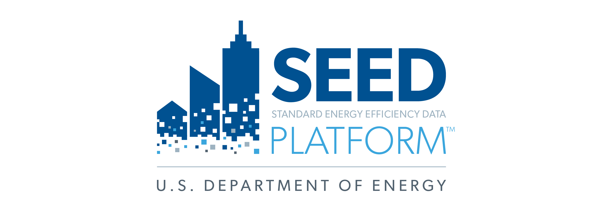

The Standard Energy Efficiency Data Platform (SEED) Platform is an open source software application designed to manage building performance data, such as required by a benchmarking ordinance, which can be costly and time consuming for states, local governments and other organizations. The SEED Platform helps users combine data from multiple sources, clean and validate it, as well as generating queries and reports. 

Browse through the [Frequently Asked Questions](faq.md) page to learn more about the SEED Platform.  View the [Getting Started](getting_started.md) page to find a SEED instance. 

SEED Platform is funded by the United States Department of Energy. Visit the [DOE Office of Energy Efficiency and Renewable Energy (EERE) SEED Platform website](http://energy.gov/eere/buildings/standard-energy-efficiency-data-platform) for more general information about this project. 
