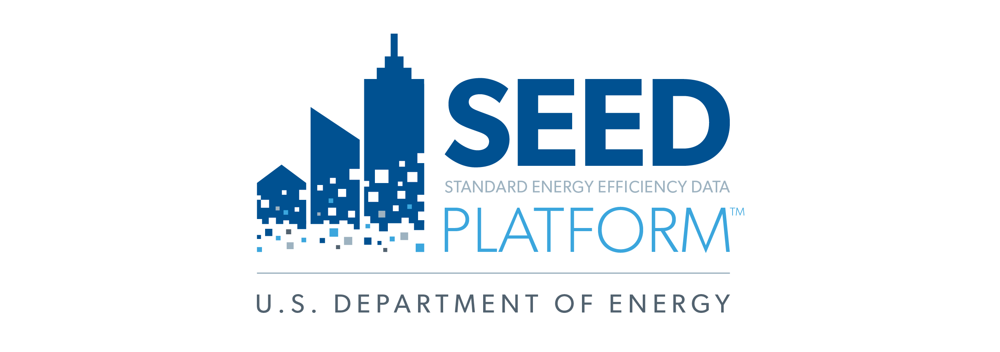

<h1 style="max-height:5px;"></h1>

	

		
	

	

		
	

The Standard Energy Efficiency Data Platform (SEED) Platform is an open-source software application designed to manage building performance data (such as required by a benchmarking ordinance) which can be costly and time consuming for states, local governments and other organizations. SEED helps users combine data from multiple sources, clean and validate it, and generate queries and reports. 

Browse the Frequently Asked Questions to learn more.  

View the [Introduction to SEED Presentation](resources/Introduction to SEED.pdf) for an overview of the SEED platform. Visit the <button class="blue"><a class="button" href="getting_started/">Getting Started</a></button> page to begin using SEED. 

SEED is funded by the United States Department of Energy. Visit the [DOE Office of Energy Efficiency and Renewable Energy (EERE) SEED Platform website](http://energy.gov/eere/buildings/standard-energy-efficiency-data-platform) for more general project information. 

