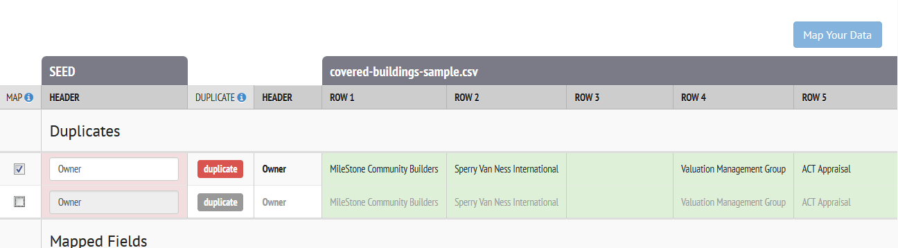
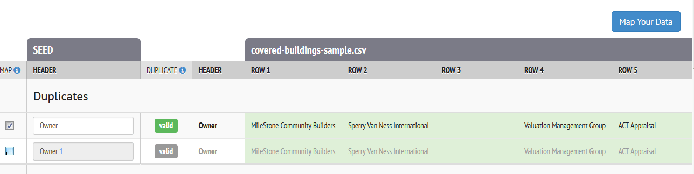
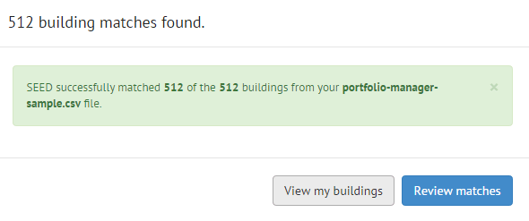

# Known Issues

## Data Import

- <h3>Things that SEED cannot deal with when importing a file:</h3>
	- **Apostrophes in field names**, such as "City's Address"  This will cause the program to hang at 45% when import the file

	- Newlines in a string fields, such as in a Portfolio Manager Property Notes field

## Mapping

- <h3>Long pause before mapping screen comes up</h3>
	- After uploading a data file, when you click on the "Continue to data mapping button", the program takes several seconds for the mapping screen to appear. Be patient, it will eventually appear. 

- <h3>Duplicate column names need to be fixed before unchecking the box</h3>
	- When two field names have the same mapping suggestion, the software disables the "Map Your Data" button, even when the checkbox on the left is unchecked. The checkbox is used to toggle whether to include the column in mapping. To enable the button, change the name of the header then uncheck the checkbox. 
	
	

- <h3>View / Hide Columns not working properly</h3>
	- Clicking the View / Hide Columns button and selecting or deselecting fields to display puts you back in the first Mapping screen and when you click Map your data to get back to the final Mapping screen, the program has not saved your changes to the displayed fields.

	[See Github Issue # 635](https://github.com/SEED-platform/seed/issues/635)

## Matching

- <h3>Number of matches records reported after record matching step is not always accurate</h3>

	- Using the sample data (see Knowledge Base for link to a zip file of sample data), after uploading, mapping and matching the two files (tax assessor building list and Energy Star Portfolio Manager data), the program should find 512 matches (the records in both files should have a 100% match). The program should report this value. However, sometimes the program reports a wrong value, but when viewing the matched records in the next step, the correct number of matches will be displayed
	
