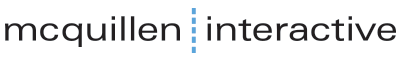

# Technical Allies

SEED Platform Technical Allies are private companies and other entities that are officially recognized for their significant contributions to the [SEED Platform Collaborative](https://www.energy.gov/cmei/buildings/seed-platform-collaborative). The Technical Ally categories are: Hosting Provider, Software Contributor, and App Developer. More information about these categories and the current qualifying Technical Allies in each category are provided below. Note that Technical Allies must meet the approval criteria annually and execute the SEED Platform trademark [sublicense](resources/SEED_LBNL_sample_license.pdf) in order to maintain their official SEED Platform Technical Ally status. The organizations listed in the three sections below have met all the approval criteria within the last year; click on their logo to find out more about the services they offer.

## Hosting Providers

These Technical Allies offer the core functionality of the SEED Platform as a hosted service to end-users.
Please see the [Hosting Provider Requirements](hosting_requirements.md) for more information about becoming an approved Hosting Provider.

  

    

       
      Earth Advantage  
      <a href="https://www.earthadvantage.org/">earthadvantage.org</a>  

      Contact: Erik Cathcart  
      <a href="mailto:ecathcart@earthadvantage.org">ecathcart@earthadvantage.org</a>
    

  

  

    

       
      Clearly Energy  
      <a href="https://clearlyenergy.com/">clearlyenergy.com</a>  

      Contact: Veronique Bugnion  
      <a href="mailto:vbugnion@clearlyenergy.com">vbugnion@clearlyenergy.com</a>
    

  

## Software Contributors

These Technical Allies have added functionality to the core [SEED Platform repository](https://github.com/SEED-platform/seed) (note that only contributors that have made significant contributions in the last year are listed below; for a complete list of SEED Platform contributors, please see the [Authors](https://github.com/SEED-platform/seed/blob/develop/AUTHORS.md) page in the SEED Platform source-code repository).
Please see the [SEED Platform Contribution Policy](https://github.com/SEED-platform/seed/blob/develop/.github/CONTRIBUTING.md) on the SEED Platform source-code repository for more information about becoming an approved Software Contributor.

  

    

        
        
       
    

  

  

    

         
        
       
    

  

## App Developers

These Technical Allies use the SEED Platform application programming interface (API) to offer value-added services using data hosted in SEED Platform.
Please see the [App Developer Requirements](app_developer_requirements.md) for more information about becoming an approved App Developer.

  

    

        
    

  

  

    

        
    

  

## Supporting Tools

These external services support SEED Platform operations.

  

    
  

