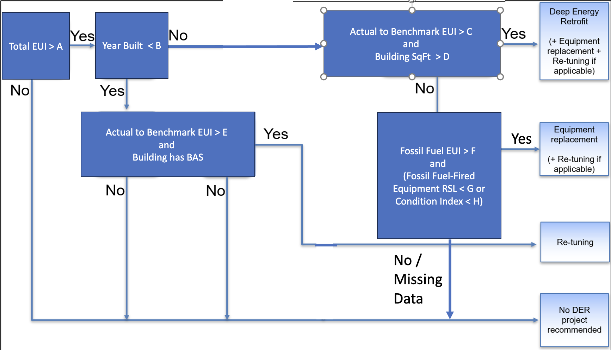

There are several analyses that can be run on properties.  Expand the sections below to learn more about each analysis.

??? note "EUI Analysis"
	## EUI Analysis

	details coming soon.

??? note "CO2 Analysis"
	## CO2 Analysis

	details coming soon.

??? note "BETTER Analysis"
	## BETTER Analysis

	details coming soon.

??? note "Energy Equity & Environmental Justice (EEEJ) Analysis"
	## Energy Equity & Environmental Justice (EEEJ) Analysis

	The Energy Equity & Environmental Justice analysis retrieves EEEJ information and indicators for your properties from various sources including:

	- [The Climate and Economic Justice Screening Tool](https://screeningtool.geoplatform.gov/en/methodology){:.external}
	- [Environmental Justice Screening and Mapping Tool (EJScreen)](https://www.epa.gov/ejscreen){:.external}
	- [The U.S. Department of Housing and Urban Development](https://hudgis-hud.opendata.arcgis.com/){:.external}

	### Analysis Pre-requisites

	The analysis requires certain data to be available in SEED in order to run successfully. The name of these fields is important at this time.

	- 'Address Line 1' field
	- 'City' and 'State' fields OR 'Postal Code' field
	- Optional: 'Latitude' and 'Longitude' from geocoded property

	The analysis workflow uses the [Census geocoder API](https://geocoding.geo.census.gov/){:.external} to retrieve each property's census tract based on the Address Line 1 + either City/State or Postal Code information. If the property has already been geocoded, this information will instead be used to determine the census tract.

	Note that the census geocoder API is a bit slow. Selecting less than 20 properties at a time for teh analysis or geocoding the properties with the MapQuest API prior to running the analysis is recommended.

	Once the census tract is determined

	### Running the Analysis

	1. First select one or more properties on the inventory list page and then choose ‘Run Analysis’ from the Actions dropdown menu:

		{:.seed-img}

	2. In the modal window that will appear, name your analysis and select “Energy Equity & Environmental Justice (EEEJ)” as the Type of analysis from the dropdown menu:

		{:.seed-img}

	3. Messages indicating an error or a successful analysis creation will be displayed in the top right corner of the page. You can click the link in the message at the top right of the screen “Click here to view your analyses”. Or you can navigate to the Analyses page from the left navigation menu.

		{:.seed-img}

	4. On the Analyses page you can see a list of analyses run and their status: 

		{:.seed-img}

	5. Click on the analysis name to access more details about the analysis. You can read a small description of the analysis explaining where the data came from at the top of the page. To see details about a specific property, click on the run ID next to the property:

		{:.seed-img}

		Details for a property include:

		- Latitude, Longitude, and Census Tract retrieved from the Census Geocoder service
		- Whether a property is classified as disadvantaged (DAC) according to the CEJST data
		- Whether a property is low income according to CEJST data
		- Whether a property is classified as having an energy burden and being low income according to CEJST data
		- The percentile of energy burden according to CEJST data
		- The share of neighboring disadvantaged tracts according to CEJST data
		- The number of affordable housing locations in the identified census tract according to HUD datasets on multi-family assisted housing and public development housing.
		- A link to the EJ screen report generated for a 1-mile area around the property

		{:.seed-img}

		An example EJ Screen report:

		{:.seed-img}

	6. As part of the analysis, the result fields above (except for the EJ Screen Report Link) have been saved directly to each property:

		{:.seed-img}

	7. Additionally, an Analysis "Card" is saved at the top of the individual Property Detail page (note that this shows only the last analysis run, but all analyses can be accessed from the Analyses menu).

		{:.seed-img}

	8. The disadvantaged census tracts can be visualized on the map page (the areas with blue shading):

		{:.seed-img}

??? note "BSyncr" Analysis"
	## Bsyncr Analysis

	details coming soon.

??? note "Element Statistics Analysis"
	## Element Statistics Analysis

	details coming soon.

??? note "Building Upgrade Recommendation Analysis"
	## Building Upgrade Recommendation Analysis

	The Building Upgrade Recommendation Analysis is a workflow that can be used to identify what types of upgrades could be performed on selected buildings based on specific parameters such as year built, gross floor area, EUI, etc. Buildings can then be prioritized based on the results of the analysis.

	The workflow implemented is depicted in the following diagram:

	{:.seed-img}

	The configurable parameters are defined as:

	- **A** the Total EUI Goal for the building (including Electricity, Gas, Etc.)
	- **B** the Year Built Threshold - The year built to use as a comparison threshold
	- **C** the Poor Actual to Benchmark EUI Ratio - The poor ratio of Total EUI to Benchmark Total EUI value to use. Ratio = Total EUI/Benchmark EUI
	- **D** the Building Square Footage Threshold - The gross square footage to use as a comparison threshold
	- **E** the Fair Actual to Benchmark EUI Ratio - The fair ratio of Total EUI to Benchmark Total EUI value to use. Ratio = Total EUI/Benchmark EUI
	- **F** the Fossil Fuel EUI Goal - The Fossil Fuel EUI Goal for the building
	- **G** the Fossil Fuel-Fired Equipment RSL Threshold - The remaining service life value to use for your fossil fuel-fired equipment as a comparison threshold in the calculations.
	- **H** the Condition Index Threshold - The condition index to use as a comparison threshold

	### Analysis Pre-requisites

	The analysis requires certain data to be available in SEED in order to run successfully:

	- Year Built 
	- Gross Floor Area
	- Total Building EUI
	- Building Gas EUI
	- Building Electricity EUI
	- Building actual energy use
	- ASHRAE Electricity EUI Target
	- ASHRAE Gas EUI Target
	- Condition Index of the Building
	- Whether a building has a Building Automation System (BAS) - represented by counting the elements of type 'D.D.C Control Panel'
	- The fossil fuel-fired element with the lowest remaining service life

	### Running the Analysis

	1. From the inventory page, select the properties in the table that you want to run the analysis on

	2. From the Actions dropdown menu, select "Run an Analysis"

	3. In the Run an Analysis modal, enter the name of the analysis and select "Building Upgrade Recommendation" as the type

	4. Once the type is selected, the modal will expand with options to set the configurable thresholds for the workflow. Fill out these values and click 'Create Analysis'
	 {:.seed-img-sm}

	5. The analysis will be created and a link will appear in the top right corner to take you directly to the analysis page. You can also access the Analyses from the "Analysis" left navigation menu.
	 {:.seed-img-sm}

	6. On the analysis page you can see details about the analysis, a list of properties that were run, and links to see individual results.

	7. On the individual property analysis results page, you can see similar information related to the configuration details and results.
		 {:.seed-img}  

	8. This analysis adds the field 'Building Upgrade Recommendation' to the analysis. 
		 {:.seed-img}

		The values entered in this field can be used to prioritize your buildings list. (For example, by filtering the inventory list by 'Deep Energy Retrofit' and labeling the resulting list of buildings with a particular label.) As shown in the diagram above, the possible values for this field are:

		- Deep Energy Retrofit
		- Equipment Replacement
		- Re-tuning
		- No DER Project Recommended
		- Missing Data