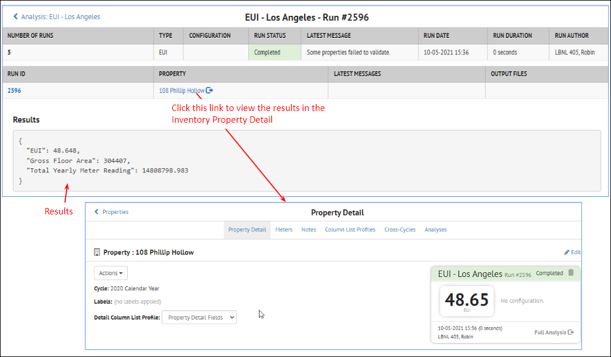
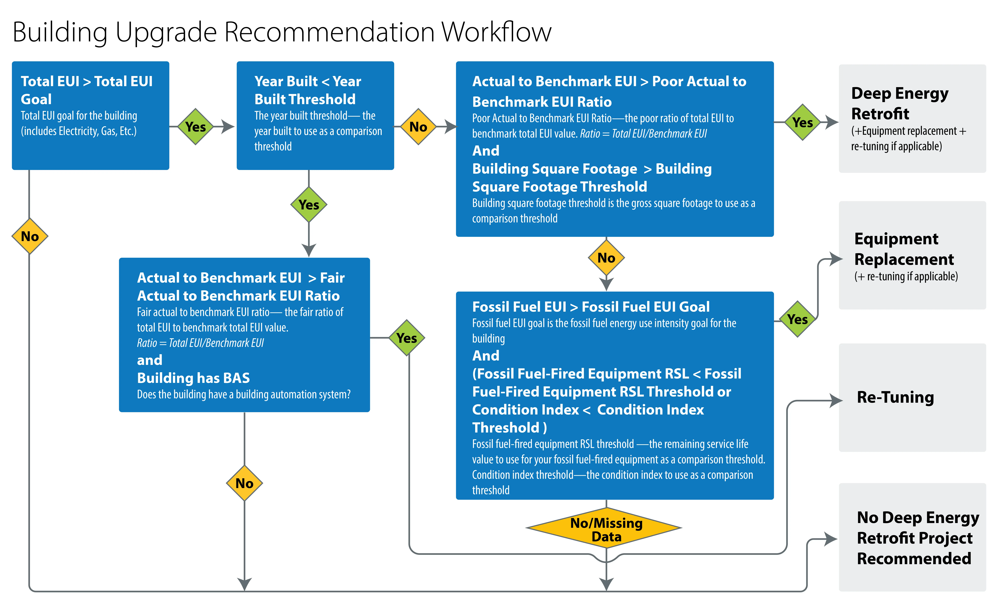

There are several analyses that can be run on properties.  Expand the sections below to learn more about each analysis.

??? note "Overview"
    ## Analysis Overview

    There are currently several different types of Analyses available in SEED:

    - **BSyncr**
    - Makes a Building Sync file from the property data in SEED to be used with the NMEC (Normalized Metered Energy Consumption) program
    - Algorithms are based on methods in this Github repository
      [NMECR Github Repo](https://github.com/kW-Labs/nmecr)
    - **BETTER**
    - Runs a BETTER analysis from the property data in SEED
      [BETTER web Tool](https://better.lbl.gov/)
    - **EUI**
    - Calculates the EUI of a property based on the meter data and the gross floor area
    - **Average Annual CO2**
    - Calculates the CO2 emissions of a property based on the meter data and the eGRID region (which is based on the location of the property)
    - **Element Statistics**
    - Provides various aggregations of the available Elements in a property

    ## Generating an Analysis

    - In the Property List, select the properties you want to perform an analysis on
    - Select Run Analysis from the Actions menu choice

    

    - Add an Analysis Name and select the Analysis Type

    

    - Depending on the analysis type, there will be various other parameters to set
    (see the sections below for each Analysis Type details)

    - Start the Analysis
    - Using the left Navigation bar, go to the Analyses section of SEED to see the results

    

    

??? note "BSyncr Analysis"
    ## Bsyncr Analysis

    the BSyncr analysis option makes a Building Sync file from the property data in SEED to be used with the NMEC (Normalized Metered Energy Consumption) program. Algorithms are based on methods in this Github repository
    [NMECR Github Repo](https://github.com/kW-Labs/nmecr)

    ### Setting up the Analysis

    - In the Property List, select the properties you want to perform an analysis on
    - Select Run Analysis from the Actions menu choice
    - Add an Analysis Name and set Type = BSyncr

    

    ### Running the Analysis

    - Click the “Create Analysis” button to start the analysis
    - Go to the Analyses page (from the left Navigation bar) to see the status of the analysis

    

    

    ### Viewing the Analysis Results

    On the Analyses page, it is possible to click on the BSyncr analysis name, and see the individual analyses, and then click on the Run IDs for each property to see the details for that property.

    
    

??? note "BETTER Analysis"
    ## BETTER Analysis

    The Building Efficiency Targeting Tool for Energy Retrofits (BETTER) is a software toolkit that enables building operators to quickly and easily identify the most cost-saving energy efficiency measures in buildings and portfolios using readily available building and energy data. For more details, see the [BETTER website](https://better.lbl.gov/).

    BETTER can be used to quickly assess the potential energy savings in a building, which then allows users to filter for the buildings with the hightest potential savings, and target those buildings for a more detailed energy audit.

    It is possible to run BETTER from the SEED Property Inventory List view, and then view the results.

    ### Analysis Pre-requisites

    In order to run a BETTER analysis from SEED on a building, the following data must be imported into the Property Inventory

    #### Building Types supported

    BETTER has built-in generated U.S. benchmark statistics for selected building types. This means that single building can be analyzed using BETTER for the following building types; this is done by selecting 'DEFAULT' as the Benchmark Data Type in the analysis.

    - Office
    - K-12 School
    - Multifamily
    - Public Library
    - Hospital (General Medical & Surgical)

    For more information on single building analytics, visit the [BETTER documentation](https://better.lbl.gov/docs/api/building_analytics/).

    Additionally, BETTER supports portfolio analytics for the following building types but requires at least 30 buildings of each type to successfully generate benchmark statistics and results. This can be accomplished by selecting 30 or more buildings of the same type and selecting 'GENERATE' as the Benchmark Data Type in the analysis:

    - Office
    - Hotel
    - K-12 School
    - Multifamily Housing
    - Worship Facility
    - Museum
    - Bank Branch
    - Courthouse
    - Data Center
    - Distribution Center
    - Fast Food Restaurant
    - Financial Office
    - Fire Station
    - Non-Refrigerated Warehouse
    - Police Station
    - Refrigerated Warehouse
    - Retail Store
    - Self-Storage Facility
    - Senior Care Community
    - Supermarket/Grocery Store
    - Restaurant
    - Public Library

    #### Data mapping on import

    Several fields must be properly mapped when imported into SEED in order to have the correct information for a BETTER analysis.

    **Property Type**
    The Property Type must be mapped (for example from the ENERGY STAR Portfolio Manager field called "Property Type - Self Selected") and must be set to a "Space Type" recognized by BETTER.
    See the [BETTER FAQ web page, Building Spaces Types section](https://better.lbl.gov/docs/faq/){:.external} section for the latest space types, as new types are added frequently.

    **Address Data**
    The Address data for the property must be mapped properly on import, according to the following fields, in order to correctly set the location and weather data that BETTER will use for the analysis.

    - 'Address Line 1' field
    - 'City' and 'State' fields OR 'Postal Code' field

    

    #### Monthly meter data

    - 12 months (or more) of consecutive meter data, for either gas or electricity, or both. This data is available from ENERGY STAR Portfolio Manager, which is one of the easiest methods for importing the data into SEED.

    #### BETTER account settings

    When a BETTER account is created, an API token can be generated in the "My Profile" section of the BETTER account. This is used in SEED to connect to BETTER in the background to run a BETTER analysis on a property in SEED.

    

    In SEED, this API token is then entered into the Organizations/Settings in the "BETTER Analysis API Key" section

    

    ### Running the Analysis

    1. In the Inventory List, select one or more properties on which you want to perform a BETTER analysis, and select ‘Run Analysis’ from the Actions dropdown menu
    

    2. The **Run Analysis** dialog box will appear. Add a descriptive name for the current analysis, and set **Type** to **BETTER**
    

    3. Setting **Type** to **BETTER** causes more settings to be displayed.
    

    4. When all the settings have been properly defined, click the **Create Analysis** button to start the analysis running. Clicking on the Analyses navigation button will go to the Analyses page, where the currently running analysis is shown. The **Run Status** column shows the progress of the analyses
    

    5. Viewing the BETTER results
    On the Analyses page, click on the Analysis Name which will then display the results for each individual property.

    

    

    SEED will display the reports in the same way as they would be displayed in BETTER.
    Click the **Run ID** link to see the reports

    

    Clicking on the Property link will display the Property Detail page for that property with the BETTER Analysis details added

    

    One the Property Detail page, clicking on the Analyses link will show all the analyses for this property

    

    SEED also saves many of the BETTER results in fields, which can then be added to the results display in both the Property List and Property Detail views

    

??? note "EUI Analysis"
    ## EUI Analysis

    ### Setting up the Analysis

    - In the Property List, select the properties you want to perform an analysis on
    - Select Run Analysis from the Actions menu choice
    - Add an Analysis Name and set Type = EUI

    

    ### Running the Analysis

    - Click the “Create Analysis” button to start the analysis
    - Go to the Analyses page to see the status of the analysis

    

    ### Viewing the Analysis Results

    On the Analyses page, it is possible to click on the EUI analysis name, and see the individual analyses

    

    Then click on the Run IDs for each property to see the details for that property.

    

    In the Property List view, the field Analysis EUI is added to show the calculated value.

    If the value is blank, it means that there was not meter data to calculate the value

    

??? note "Average Annual CO2 Analysis"
    ## Average Annual CO2 Analysis

    ### Data Import

    - In the Property data being imported to SEED, for a CO2 analysis the following must be added
    - eGRID Subregion Code
    - Find the eGRID Subregion definitions here
      [eGRID Subregion Codes](https://www.epa.gov/egrid/summary-data)

    

    ### Setting up the Analysis

    - In the Property List, select the properties you want to perform an analysis on
    - Select Run Analysis from the Actions menu choice
    - Add an Analysis Name and set Type = Average Annual CO2

    

    ### Running the Analysis

    - Click the “Create Analysis” button to start the analysis
    - Go to the Analyses page (from the left Navigation bar) to see the status of the analysis

    

    ### Viewing the Analysis Results

    On the Analyses page, it is possible to click on the CO2 analysis name, and see the individual analyses

    

    Then click on the Run ID or the Property link for each property to see the details for that property.

    

    In the Property List view, the fields “Average Annual CO2” and “Average Annual CO2 Coverage” contain the CO2 results in the Inventory Property List View.

    

??? note "Element Statistics Analysis"
    ## Element Statistics Analysis

    This Analysis provides aggregation values of the available Elements that exist on the Property Details page for a property.

    {:.seed-img}

     There are two different types of aggregations that will be generated:

    1. The analysis will determine if there are any Component_SubTypes that equal “D.D.C. Control Panel”. This will create a new field called "Has D.D.C. Control Panels”. This field will be zero (or False) if there are no Component_SubTypes equal to “D.D.C Control Panel” in the Elements table for a property and one (or True) if there are Component_SubTypes equal to “D.D.C Control Panel” in the Elements table for a property.

    2. The analysis will calculate the aggregate Condition Index of the EISA 2007-432 Uniformat Categories listed below as an average.  This value will then create new fields called “WINDOWS CI”, “DOMESTIC WATER EQUIPMENT CI”, etc. This field will be blank if there are missing Uniformat categories for a property. The Uniformat categories are listed below.

    | Uniformat Category|
    | -------- |
    | OTHER STANDARD FOUNDATIONS |
    | OTHER FLOOR CONSTRUCTION |
    | INSULATION & VAPOR RETARDER |
    | EXTERIOR LOUVERS & SCREENS |
    | SUN CONTROL DEVICES |
    | WINDOWS |
    | EXTERIOR GLAZING |
    | ROOF INSULATION & FILL |
    | OTHER CEILING & CEILING FINISHES |
    | OTHER VERTICAL TRANSPORTATION EQUIPMENT |
    | WATERCLOSETS |
    | PIPES & FITTINGS |
    | DOMESTIC WATER EQUIPMENT |
    | SPECIALTIES |
    | OTHER DOMESTIC WATER SUPPLY |
    | SOLAR ENERGY SUPPLY SYSTEMS |
    | WIND ENERGY SUPPLY SYSTEM |
    | OTHER ENERGY SUPPLY |
    | BOILERS |
    | OTHER HEAT GENERATING SYSTEMS |
    | CHILLED WATER SYSTEMS |
    | DIRECT EXPANSION SYSTEMS |
    | OTHER COOLING GENERATING SYSTEMS |
    | AIR DISTRIBUTION, HEATING & COOLING |
    | STEAM DISTRIBUTION SYSTEMS |
    | HOT WATER DISTRIBUTION SYSTEMS |
    | AIR HANDLING UNITS |
    | OTHER DISTRIBUTION SYSTEMS |
    | PACKAGE UNITS |
    | HVAC CONTROLS |
    | ELECTRONIC CONTROLS |
    | PNEUMATIC CONTROLS |
    | OTHER CONTROLS INSTRUMENTATION |
    | REFRIGERATION SYSTEMS |
    | OTHER SPECIAL MECHANICAL SYSTEMS |
    | SERVICE ENTRANCE EQUIPMENT |
    | MOTOR CONTROL CENTERS |
    | OTHER SERVICE AND DISTRIBUTION |
    | LIGHTING EQUIPMENT |
    | OTHER LIGHTING AND BRANCH WIRING |
    | IRRIGATION SYSTEMS |
    | PACKAGED SANITARY SEWER TREATMENT PLANTS |
    | OTHER SANITARY SEWER |
    | GAS DISTRIBUTION PIPING (NATURAL AND PROPANE) |
    | TRANSFORMERS |
    | SWITCHES, CONTROLS & DEVICES |
    | OTHER ELECTRIC TRANSMISSION & DISTRIBUTION |
    | EXTERIOR LIGHTING FIXTURES & CONTROLS |

??? note "Building Upgrade Recommendation Analysis"
    ## Building Upgrade Recommendation Analysis

    The Building Upgrade Recommendation Analysis is a workflow that can be used to identify what types of upgrades could be performed on selected buildings based on specific parameters such as year built, gross floor area, EUI, etc. Buildings can then be prioritized based on the results of the analysis.

    The workflow implemented is depicted in the following diagram:

    {:.seed-img-lg}

    The configurable parameters are defined as:

    - **Total EUI Goal** - The Total EUI Goal for the building (including Electricity, Gas, Etc.)
    - **Year Built Threshold** - The year built to use as a comparison threshold
    - **Poor Actual to Benchmark EUI Ratio** - The poor ratio of Total EUI to Benchmark Total EUI value to use. Ratio = Total EUI/Benchmark EUI
    - **Fair Actual to Benchmark EUI Ratio** - The fair ratio of Total EUI to Benchmark Total EUI value to use. Ratio = Total EUI/Benchmark EUI
    - **Building Square Footage Threshold** - The gross square footage to use as a comparison threshold
    - **Fossil Fuel EUI Goal** - The Fossil Fuel EUI Goal for the building
    - **Fossil Fuel-Fired Equipment RSL Threshold** - The remaining service life (RSL) value to use for your fossil fuel-fired equipment as a comparison threshold in the calculations.
    - **Condition Index Threshold** - The condition index to use as a comparison threshold

    ### Analysis Pre-requisites

    The analysis requires certain data to be available in SEED in order to run successfully:

    - Year Built
    - Gross Floor Area
    - Total Building EUI
    - Building Gas EUI
    - Building Electricity EUI
    - Building actual energy use
    - ASHRAE Electricity EUI Target
    - ASHRAE Gas EUI Target
    - Condition Index of the Building
    - Whether a building has a Building Automation System (BAS) - represented by having the element of type 'Has D.D.C Control Panels'
    - The fossil fuel-fired element with the lowest remaining service life

    The analysis will allow a user to select which fields to use for the information above, with the exception of "Year Built" and "Gross Floor Area": the canonical SEED fields "Year Built" and "Gross Floor Area" are automatically used to capture this information.

    ### Running the Analysis

    1. From the inventory page, select the properties in the table that you want to run the analysis on

    2. From the Actions dropdown menu, select "Run an Analysis"

    3. In the Run an Analysis modal, enter the name of the analysis and select "Building Upgrade Recommendation" as the type

    4. Once the type is selected, the modal will expand with options to set the configurable thresholds for the workflow. Fill out these values and click 'Create Analysis'
      {:.seed-img-sm}

    5. The analysis will be created and a link will appear in the top right corner to take you directly to the analysis page. You can also access the Analyses from the "Analysis" left navigation menu.
      {:.seed-img-sm}

    6. On the analysis page you can see details about the analysis, a list of properties that were run, and links to see individual results.

    7. On the individual property analysis results page, you can see similar information related to the configuration details and results.
      {:.seed-img}

    8. This analysis adds the field 'Building Upgrade Recommendation' to the analysis.
      {:.seed-img}

      The values entered in this field can be used to prioritize your buildings list. (For example, by filtering the inventory list by 'Deep Energy Retrofit' and labeling the resulting list of buildings with a particular label.) As shown in the diagram above, the possible values for this field are:

    - Deep Energy Retrofit
    - Equipment Replacement
    - Re-tuning
    - No DER Project Recommended
    - Missing Data
