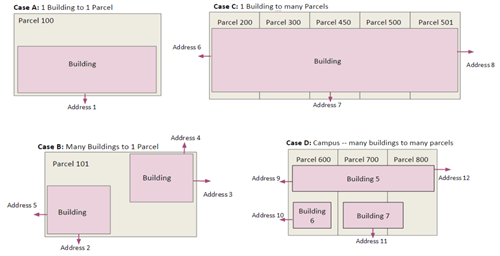
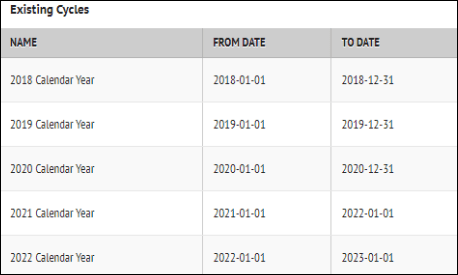
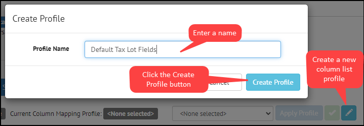
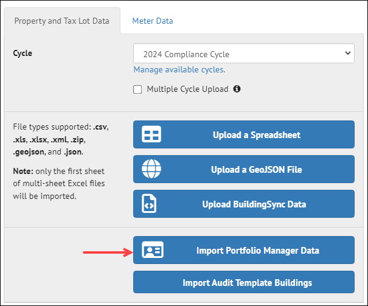

## **Data Import**

SEED is primarily a data management platform, and importing the data is
a critical component to understand.

??? note "**Overview**"

    SEED can import data from many different sources, for example:

    ## Building / Property Data

    Building and property lists can sometimes be difficult to create. There
    are a few different sources of data that may help, which can be imported
    into SEED in the form of spreadsheets with one line per building, such
    as:

    -   Tax assessor lists
    -   Real estate data

    ## Benchmarking data

    One of the primary sources of building information for benchmarking and
    Building Performance Standards (BPS) ordinances is data entered by
    building owners into ENERGY STAR Portfolio Manager which is then shared
    with jurisdictions who are determining compliance with the ordinances.

    SEED can import data from spreadsheets downloaded from ENERGY STAR
    Portfolio Manager and then imported into SEED. It is also possible to
    log into an ENERGY STAR Portfolio Manager account directly from SEED and
    specify a "Custom Report Template" to be imported. 

    ## Match data from different sources

    One of the strengths of SEED is that data for a specific building or
    property can be imported from multiple sources and then matched and
    merged within SEED so that all the information related to that building
    is collected in one platform.

    In order for the data from different sources to be merged together,
    there must be one or more "matching" fields that are in all the data.
    These fields are identified during the data import "Mapping" step, which
    will be discussed in the next section. These matching fields typically
    include:

    -   Tax Assessor Parcel ID
    -   Custom Building ID
    -   ENERGY STAR Portfolio Manager ID
    -   Unique Building ID (UBID)

    ## Handle data with different types of relationships

    In addition to matching and merging data for the same building or
    property, SEED can establish a relationship between a Tax Assessor
    Parcel and the buildings or properties associated with that parcel.
    Establishing this relationship is optional, but if Tax Assessor Parcel
    data is used to begin the creation of a building or property list, or
    the parcel / building relationship is desired, SEED can accomplish this
    during the mapping process, as long as there is both a tax parcel ID and
    a building or property ID in the data being imported.

    The image below shows the possibilities of tax parcel and building
    relationships:

    -   Case A: A one to one relationship, ie, one building on one parcel
    -   Case B: Multiple buildings on one parcel
    -   Case C: One building on multiple parcels
    -   Case D: Multiple buildings on multiple parcels, such as a campus
        > scenario

     

    The SEED data model establishes the relationship between the tax parcels
    and buildings as shown in the simplified diagram below. In the main
    Inventory list view, there are two tabs, one for Property and one for
    Tax Lot.

    

    ## Maintain data based on compliance year

    Data is imported into SEED by "cycles", which are generally defined on a
    calendar basis, to keep track of the annual compliance of buildings.
    There are several features in SEED which allow importing, viewing, and
    analyzing the status of buildings across cycles.

    ## Data import workflow

    The first three steps in the diagram below shows the workflow when
    importing data into SEED

    

## **Before importing data**

There are a few steps that should be completed before importing data, in
order to have a smooth process.

- Define cycles
- Define Matching fields

??? note "**Cycles**"

    ## Define Cycles in Organizations / Cycles

    It is important to create the appropriate cycle to import the data into.
    SEED has one "default" cycle that can be used as is, or edited to suit
    the first data import. It is also possible to make as many cycles as
    needed to import the data.

    

    

    ## **Data files with multiple years of data**

    If a file is to be imported with multiple cycles (years) of data in it,
    the appropriate cycles need to be defined before importing the data. For
    example, if there is data from 2019, 2020 and 2021 in one file, and that
    data is to be associated with the cycle for each year, a cycle for each
    of those years needs to be defined. SEED uses a field called "Year
    Ending". This is a default field that is in ENERGY STAR Portfolio
    Manager data, but could be added to other data if needed.

    

    Make sure that a cycle is defined for each year of data in the data
    file.

    

??? note "**Matching Fields**"
    ## Define Matching fields in Organizations / Column Settings

    In order to map the fields properly when importing data, it is important
    to define the fields that will be the "matching" fields across data
    files.

    The matching fields are defined in Organizations / Column Settings.
    There is a column called "MATCH CRITERIA", and the fields that are
    matching fields should be checked. There can be just one field defined,
    or multiple fields. Standard fields for matching are the PM Property ID
    field from ENERGY STAR Portfolio Manager, and/or the Custom ID 1 field,
    which can represent any unique building ID.

    The Column Description field can be edited to represent a more
    descriptive name. For example, if the matching field is Custom ID 1,
    that Column Description could be changed to "City X Building ID".

    Default matching fields for **Properties** include:

    - PM Property ID (ENERGY STAR Portfolio ID)
    - Custom ID 1 (A custom ID for each building)
    - UBID (Unique Building ID, generated according to a specific algorithm)

    Default matching fields for **Tax Lots** include:

    - Jurisdiction Tax Lot ID

    

    Once the cycles are properly defined and the matching fields are set, it
    is time to import the data

## **Importing data - General**
The first few steps for importing Property and Tax Parcel data are the same 
??? note "**Getting Started**" 

    There are a few different ways to start importing data. You can click
    the DATA navigation button on the left side of the screen, or you can
    click on the "Upload your Buildings List" button on the main SEED
    Platform screen.

    

??? note "**Create a data set**"

    The DATA navigation button on the left side of the application will
    display the screen shown below, where a new data set can be created. The
    Data Set Name can be any text that describes the data set that is being
    created. There will potentially be multiple files imported in a data
    set.

    

    Clicking the "Create Data Set" button will open the screen shown below,
    which has several options for what type of data to upload, as well as
    how to upload it.

    The first step is to assign this data upload to a cycle \-- the pull
    down list will show all the cycles that are defined. It is also possible
    to define a new cycle by clicking the "Manage available cycles" link
    under the Cycle pulldown. And if the file being imported has multiple
    years defined (based on a field called "Year Ending") the "Multiple
    Cycle Upload" box can be checked.

    

??? Note "**Upload a Spreadsheet**"

    The first option in the list of upload options is "Upload a
    Spreadsheet".

    This option assumes that the spreadsheet will have one record per
    property or tax parcel. This spreadsheet can contain both property /
    building and tax parcel information, or it can be just one or the other.

    Here is an example of a spreadsheet representing a list of tax parcels
    that have buildings on them. Each row represents a tax parcel.

    

    Here is an example spreadsheet of building information from ENERGY STAR
    Portfolio Manager for the same buildings. In this case, each row
    represents an individual building, and each row has the tax parcel ID
    associated with the building.

    

    When these two spreadsheets are imported into SEED, the relationship
    between the tax lots and buildings can be established in the mapping
    step.

## **Importing Tax Parcel Data**

??? Note "**Upload a spreadsheet**"

    First, import the tax parcel spreadsheet into the data set by clicking
    the Upload a Spreadsheet button, navigating to the file to be imported,
    and as the file is imported, messages will appear to show the progress
    of the upload.

    

    This message appears when the file has completed the first upload step.
    Click the "Continue to data mapping" button to move to the next step.

    

??? Note "**Mapping the fields**"

    The Mapping screen will now appear, and the fields in the uploaded file
    need to be mapped to the appropriate SEED fields.

    If this is the first file being imported, the easiest way to start the
    mapping is to click the "Copy Data File Headers directly to SEED
    headers" which copies the fields from the right hand side (the fields in
    the uploaded file) to the SEED Mapped Fields on the left side.   

    Select "Tax Lot" for the "Set all fields to" pulldown list

    Change the field called "Parcel Number" to the matching field
    "Jurisdiction Tax Lot ID". 

    

    

    Save the final mapping to a "Column Mapping Profile name, to save the
    mappings for another file of the same structure.

    

    This creates a Column Mapping profile that can be used again for another
    file with the same fields.

    

    Then click the Map Your Data button to go to the Mapping Review screen.

    

??? note "**Review the mapped data**"

    In the Mapping Review screen all the records will be displayed, with the
    new field mapping. If there is anything that needs to be changed, click
    the Back to Mapping button and the mapping can be changed as needed.

    

??? note "**Save field mappings and view the results in the Inventory List View **"
    Click the Save Mappings button to complete the data upload process; a
    confirmation screen will be displayed. Click the Confirm mappings

    

    A progress bar will be displayed.

    

    When the matching is complete, a summary of what was imported will be
    displayed.

    

    Click the View my Properties to go to the Inventory list to see the
    uploaded data.

    To see the Tax Lot data, click on the Tax Lot tab
    

## **Importing ENERGY STAR Portfolio Manager Data**

??? note "**Import Options**"
    There are two methods for importing ENERGY STAR Portfolio Manager Data

    -   **Option 1:** Download a spreadsheet from the ENERGY STAR Portfolio Manager application and import that spreadsheet into SEED, in the same manner as any spreadsheet.
    -   **Option 2:** Log in to the ENERGY STAR Portfolio Manager account from SEED and specify the Custom Report Template to upload into SEED. This eliminates the need to use the spreadsheet option.

    

??? note "**Option 1: Upload an ENERGY STAR Portfolio Manager spreadsheet**"

    After uploading the tax lot spreadsheet, the next step might be to load the ENERGY STAR Portfolio Manager spreadsheet for the buildings associated with the tax lots already imported.

    ENERGY STAR Portfolio Manager data can also be imported by itself, without having imported tax lot data.

    The same steps are followed as any other spreadsheet:

    -   In the same Data Set, click the **Add more data files** link

    

    -   Make sure the same cycle is selected, then click the Upload a Spreadsheet button.

    

    -   Browse to the appropriate file

??? note "**Option 2: Import ENERGY STAR Portfolio Manager Data**"

    It is possible to log directly into an ENERGY START Portfolio Manager account and specify the Custom Report Template to import. With this option, SEED will automatically regenerate the Custom Report Template in the ENERGY STAR Portfolio Manager account, and then download the data to SEED.

    -   Make sure to select the correct Cycle   
    -   Click the "Import Portfolio Manager Data" from the Import screen

    

    -   Input the Username and Password into the appropriate fields
    -   Click the "Get Report Templates" button, which will cause all the Custom Report Templates for that account to be displayed.
    -   Select the desired Custom Report Template
    -   Click the "Submit" button

    

??? note "**Mapping the fields**"
    In the Mapping screen
    -   Copy the Data File headers to the SEED headers
    -   Set the INVENTORY TYPE to Property for all fields except "Parcel ID"
    -   Set the INVENTORY TYPE to Tax Lot for the "Parcel ID" field, and change the SEED Header mapping to the Tax Lot matching field "Jurisdiction Tax Lot ID". This will establish the relationship between the **PM Property ID** Matching field and the **Jurisdiction Tax Lot** field for each record
    -   Save the final mapping to a new Column Mapping Profile
    -   Click Map Your data to go to the Mapping Review screen

    

    Mapping the Parcel ID to the Tax Lot table and the PM Property ID to the Property table results in records where the data from each can be viewed together.

    

??? note "**Review the mapped data and view the results in the Inventory List View**"
    The Mapping Review screen will show the records mapped to the Properties table and the records mapped to the Tax Lot table
    

    Click Save Mappings to finish the record mapping and matching process

    The progress bar will be displayed

    

    The results of the matching and merging will be displayed

    

    Click the View my properties button to view the imported data in the Inventory List View

    

