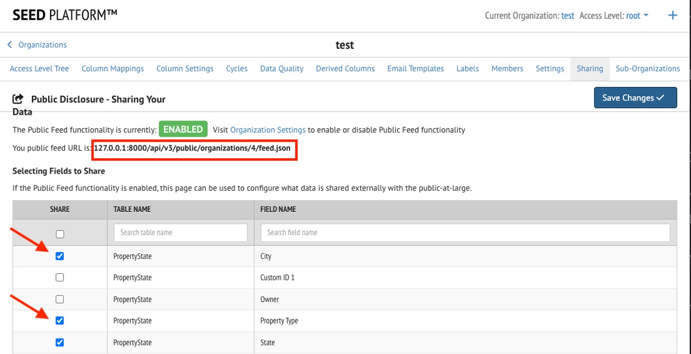
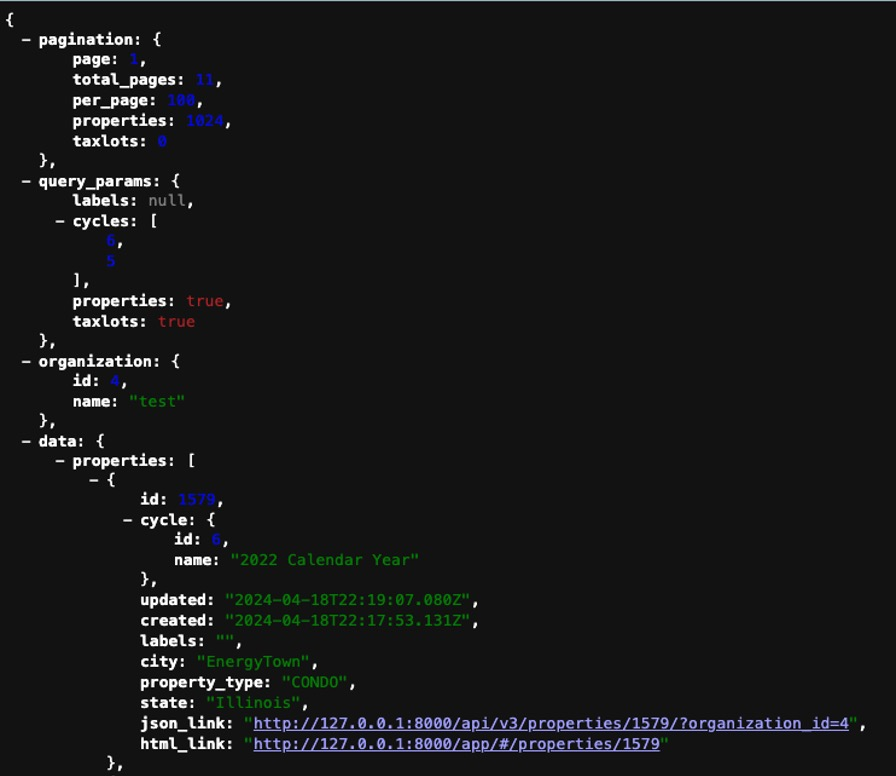

Expand the following sections to find out more about the functionality available in SEED.

??? note "Setting up a Public Feed"
	### Enabling and Configuring your Organization's Public Feed

	Organization owners can enable a Public Feed of their properties and tax lots. They can select a subset of fields that will be made public. The public feed is available in JSON and HTML formats.

	The Public Feed functionality can be enabled from the organization settings page. From this same page you can choose to expose the labels applied in the public feed.

	{:.seed-img}

	Once the functionality is enabled, navigate to the Organization Sharing page. From this page, you can set up which fields should be shared by checking the checkbox next to each field.  Both property and tax lot fields will be listed, and you can use the filters on the top of the table to refine your search.

	{:.seed-img}

	The Public Feed is available at the following URL:
	{SEED URL}/api/v3/public/organizations/{ORGANIZATION ID}/feed.json
	where {SEED URL} is the URL of your SEED instance (https://seedv2.lbl.gov, for example), and {ORGANIZATION ID} is the ID of your organization within SEED.  

	The Public Feed page will load a JSON view of the data that you have configured to share publicly, organized by cycle. The ‘id’ key shown here corresponds to a ‘property view’ in SEED, which represents the building data in a specific cycle. The ‘pagination’ section provides statistics on the number of properties available, the ‘query_params’ section returns the filters that were applied to generate this list, and the list of buildings can be found in the ‘data’ section.

	{:.seed-img}

	### Public Feed Filtering Details

	The public feed endpoint returns property and tax lot data for a given organization as a json object. The results are ordered by "last updated". Optional and configurable URL query parameters:

	- *labels* - if enabled, comma-separated list of case sensitive label names. Results will include inventory that has any of the listed labels. Default is all inventory
	- *cycles* - comma-separated list of cycle IDs. Results include inventory from the listed cycles. Default is all cycles
	- *properties* - boolean to return properties. Default is True
	- *taxlots* - boolean to return tax lots. Default is True
	- *page* - integer page number. Default is 1
	- *per_page* - integer results per page. Default is 100
  
  	### Example Requests

	{SEED URL}/api/v3/public/organizations/{organization_id}/feed.json?{query_param1}={value1}&{query_param2}={value2}

	{SEED URL}/api/v3/public/organizations/{organization_id}/feed.json?page=1 

	{SEED URL}/api/v3/public/organizations/{organization_id}/feed.json?page=2&labels=Compliant&cycles=1,2,3&taxlots=False 
