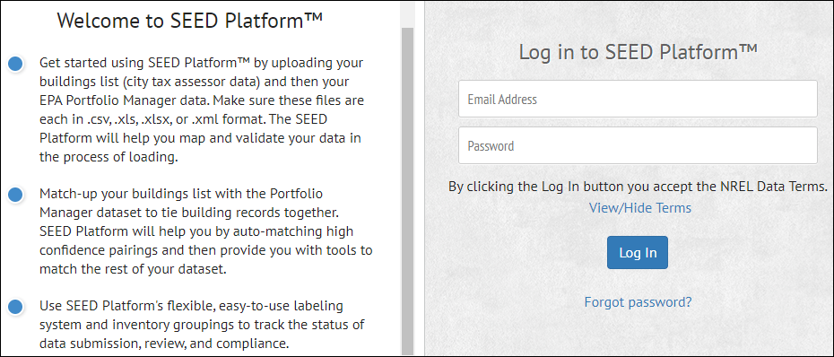
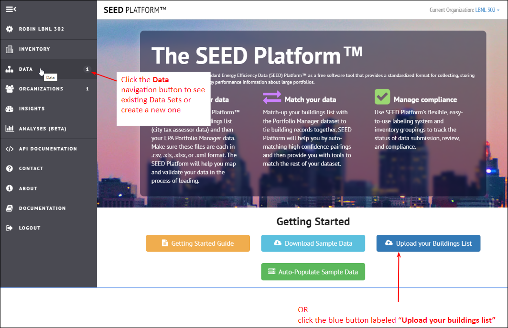
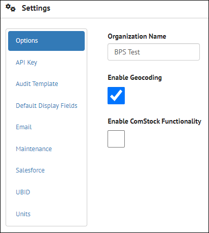
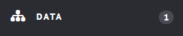
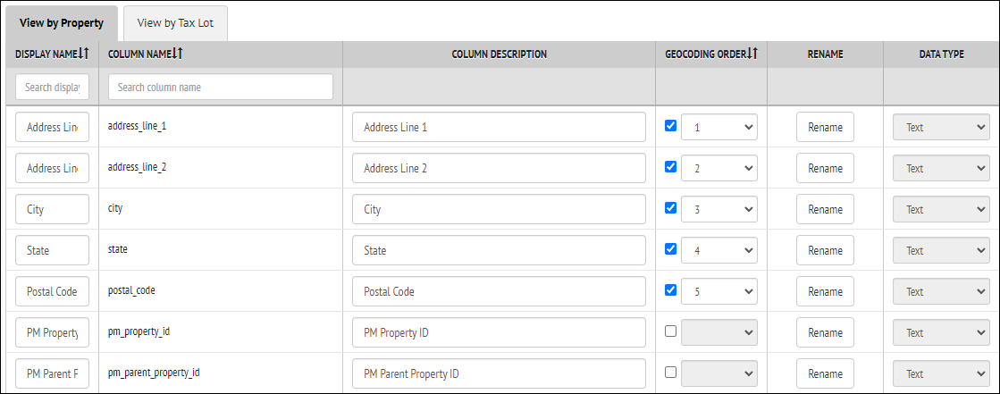
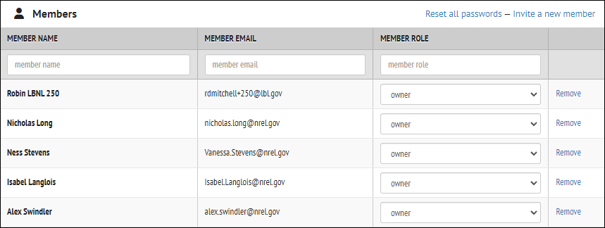

# Getting Started {#getting-started .unnumbered}

Main screen

When you first open SEED you will see the main screen

## Main Navigation {#main-navigation .unnumbered}

The primary navigation options in SEED are shown on the left hand side
of every screen, as shown below.

##  {#section .unnumbered}

## Inventory {#inventory .unnumbered}

After building data is imported into SEED, it can be accessed from the
Inventory navigation button. The data can be viewed by cycle, as well as
by Property and Tax Lot.

The links at the top of the page allow different views of the data, as
follows:

#### **Properties List:** Displays the latest version of the Properties List view

#### **Properties List (legacy):** Displays the previous version of the Properties List view which will be deprecated at some point

#### **Column List Profiles:** Allows creation of multiple field lists with different fields selected

#### **Cross-Cycles:** Allows viewing data across multiple cycles

#### **Map:** If the properties have been correctly geocoded, they will be displayed on a map based on those locations

#### **Data:** Links to Insights 

#### **Summary (Beta):** Displays summary information about the records and fields by cycle

## Data {#data .unnumbered}

The Data navigation tab will take you to the Data Sets view, where Data
Sets (groups of imported files) can be created, and files imported. For
Energy Benchmarking and Building Performance Standards, creating data
sets based on compliance years is a standard method of organizing the
data imports.

There are several types of data that can be imported, including

-   Spreadsheets with one line per building, such as from Tax Assessor
    data or real estate data

-   ENERGY STAR Portfolio Manager data for one or more buildings with
    Annual Energy Data

-   ENERGY STAR Portfolio Manager data for one or more buildings with
    Monthly Energy Data

-   GeoJSON data for spatial data information, such as latitude and
    longitude

-   Data from the DOE tool Audit Template or Asset Score (via the
    BuildingSync format)

##   {#section-1 .unnumbered}

## Organizations {#organizations .unnumbered}

The Organizations navigation button is used to view many of the options
for setting up the data import and data management.

The links at the top of the Organizations page are the following

-   **Column Mappings:** manage the field names that are mapped on
    import, creating Column Mapping Profiles for different file types

> 

-   **Column Settings:** manage various settings for the mapped fields,
    including:

    -   display name

    -   column description

    -   geocoding fields

    -   data type

    -   matching field definition

> 

-   **Cycles:** manage cycle definitions, including creating new cycles,
    editing existing cycles (both names and dates), and deleting
    existing cycles

> 

-   **Data Quality:** manage data quality rules, including defining new
    rules and adding labels to them, editing and deleting existing rules

> 

-   **Derived Columns:** manage derived columns (fields calculated from
    other fields), including creating new fields, editing and deleting
    existing fields

> 

-   **Email Templates:** manage email templates, which can be used to
    send "bulk" emails to contacts for SEED records, including creating
    new templates, editing and deleting existing templates

-   **Labels:** manage labels, which can be added to Inventory records
    (property and tax lots), including creating new labels, editing and
    deleting existing labels

> 

-   **Members:** manage access to seed by adding, editing or deleting
    members, including setting permissions (options are Owner, Member or
    Viewer)

> 

-   **Program Setup:** create new settings, and edit existing settings,
    for Insights

-   **Settings:** manage many different settings, including API keys
    (for geospatial definitions, Audit Template import, and BETTER
    analyses), default display fields, Salesforce connections, UBID
    matching, and units for numeric fields.

> 
> 

-   **Sharing:** manage what fields are shared

-   **Sub-Organization:** manage sub-organizations, if any, to the main
    organization

## Insights {#insights .unnumbered}

The Insights feature in SEED allows analysis of benchmarking or Building
Performance Standards compliance over time based on setting performance
targets into the future and showing how buildings are meeting those
targets, both individually and as a group, over specific time periods.

The image below shows the compliance of a portfolio of buildings over a
5 year time period, 2019 - 2023, with the compliance of the buildings
increasing during that period.

It is also possible to view the compliance of individual buildings for a
particular period of time (cycle), on the Property Insights page, where
the blue dots indicate buildings that have met their compliance targets,
and the red triangles indicating buildings that have not met their
targets, with the "whisker line" showing the distance from compliance
for those buildings.

It is also possible to see the compliance trend compared to a target
over time in a graph

## Analyses {#analyses .unnumbered}

The Analyses feature has many different analysis options, including the
following:

## API Documentation {#api-documentation .unnumbered}

The API Documentation page uses Swagger to document, in detail, the API
calls that are available to access data in SEED.

## Contact {#contact .unnumbered}

The Contact page has information and links to various websites about
SEED, as well as a link to the SEED Github open source repository.

## About {#about .unnumbered}

The about page has information about the development team as well as the
version number of the program release being used.

## Documentation  {#documentation .unnumbered}

The Documentation page has a series of Frequently Asked Questions

## Logout {#logout .unnumbered}

Clicking the Logout navigation button will log the user out of the
current session, and allow the user to log in again.

