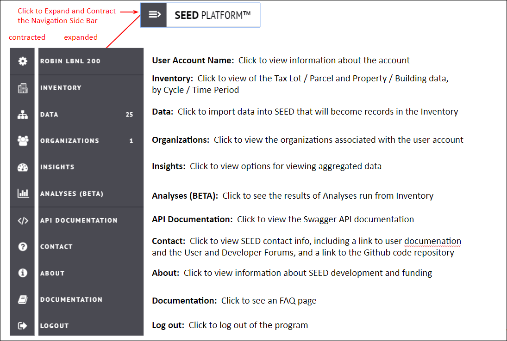
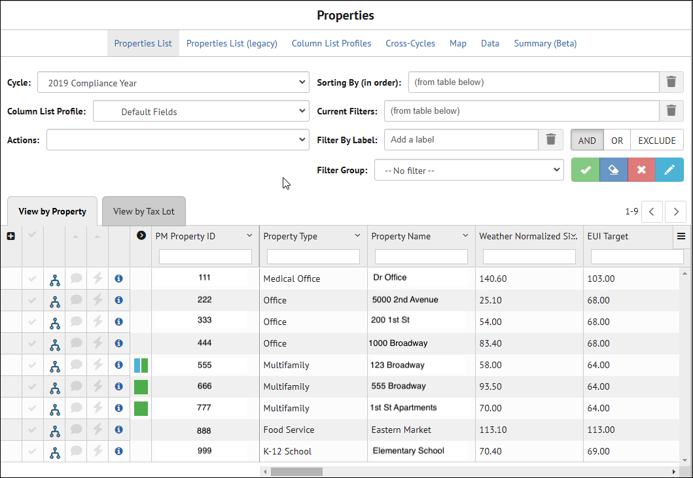
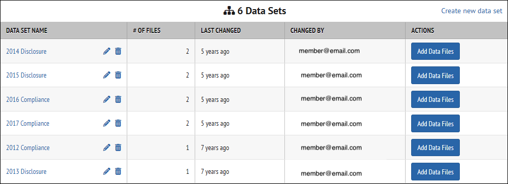
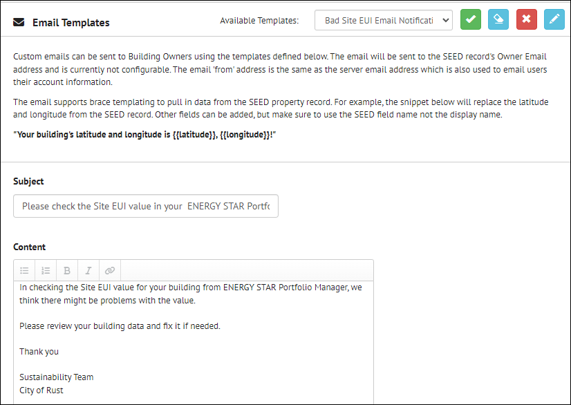
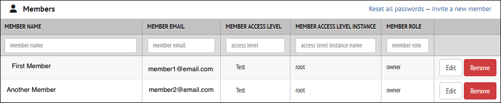
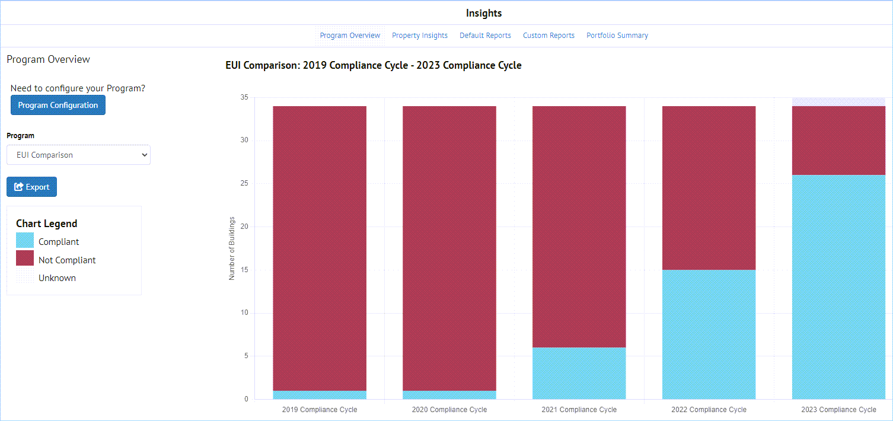
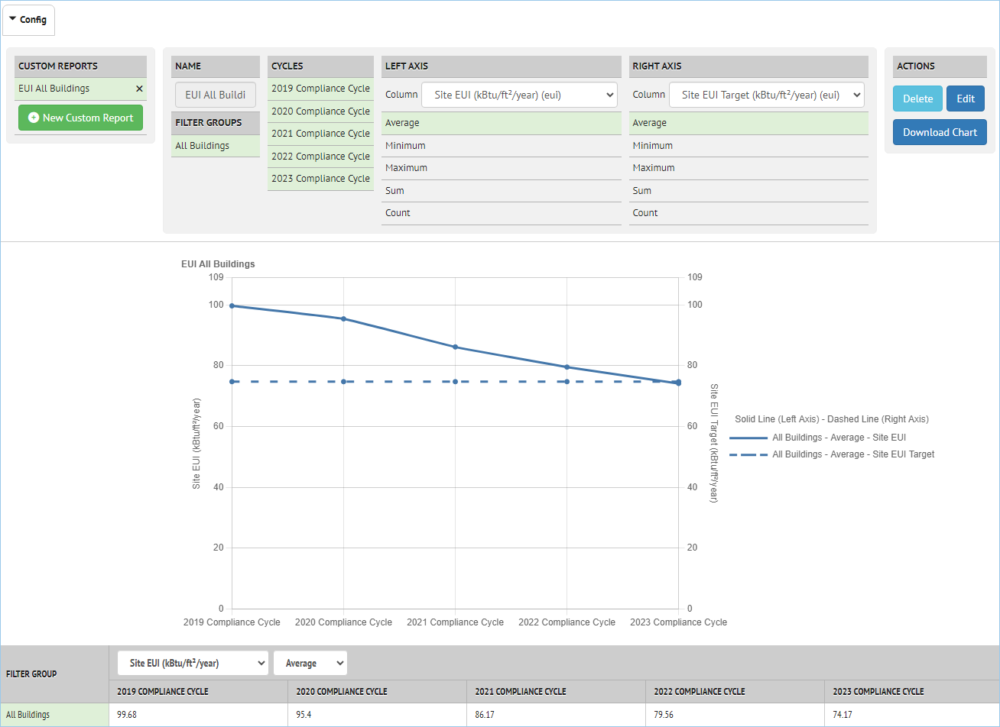
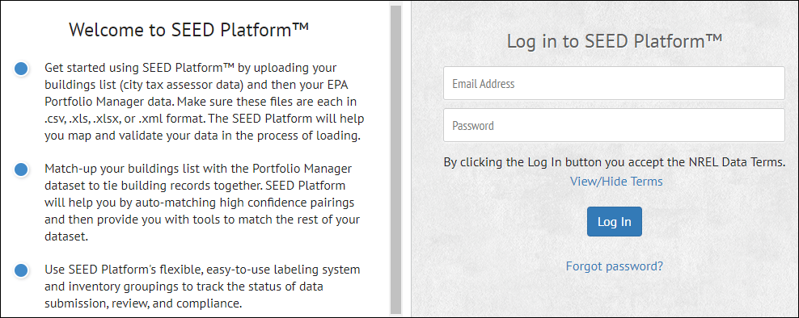

To get started with SEED, you need to log in with you account credentials, and then the main screen will be displayed.

??? note "Getting Started"
    ## Getting Started

    ### Log in to SEED

    The first thing to do is to log in to SEED with your user email and password. These are assigned to you by the SEED administrator.

    To see the NREL Data Terms for SEED, click the "View/Hide Terms" link

    

    ### Main screen

    After logging in to SEED, you will see the main screen

    

    ### Sample Data

    The SEED Sample Data collection includes two files and can be downloaded from the table below:

    - **covered-buildings-sample.csv**&mdash;sample tax assessor data with 512 building records
    - **portfolio-manager-sample.csv**&mdash;sample Energy Star&reg; Portfolio Manager&reg; data with 512 records which match the data in covered-buildings-sample.csv based on the Address field

    Note that this represents an ideal case, but it can be used to confirm proper program performance.

    All sample data should work with all versions of SEED, although the newer datasets may contain fields that do not exist in earlier versions.

    | Version | Files |
    |---------|-------|
    | 2.7.0-Beta | [Covered Buildings Sample File](https://raw.githubusercontent.com/SEED-platform/seed/v2.7.0-Beta/seed/tests/data/covered-buildings-sample.csv) &nbsp; &nbsp; [Portfolio Manager Sample File](https://raw.githubusercontent.com/SEED-platform/seed/v2.7.0-Beta/seed/tests/data/portfolio-manager-sample.csv) |
    | 2.6.1 | [Covered Buildings Sample File](https://raw.githubusercontent.com/SEED-platform/seed/v2.6.1/seed/tests/data/covered-buildings-sample.csv) &nbsp; &nbsp; [Portfolio Manager Sample File](https://raw.githubusercontent.com/SEED-platform/seed/v2.6.1/seed/tests/data/portfolio-manager-sample.csv) |

    See the [Importing Data](user_doc_data_import.md) page for more information on importing data.

## Main Navigation

The primary navigation options in SEED are shown on the left hand side
of every screen, and they can be expanded to show full titles or collapsed to just show icons.

??? note "Main Navigation"

    

## Inventory

The Inventory screen displays the buildings that have been imported into SEED.

??? note "Inventory"
    After building data are imported into SEED, they can be accessed from the
    Inventory navigation button. The data can be viewed by cycle, as well as by Property and Tax Lot.

    

    The links at the top of the page allow different views of the data, as follows:

    * **Properties List:** Displays the latest version of the Properties List view

    * **Column List Profiles:** Allows creation of multiple field lists with different fields selected

    * **Cross-Cycles:** Allows viewing data across multiple cycles

    * **Map:** If the properties have been correctly geocoded, they will be displayed on a map based on those locations

    * **Data:** Links to Insights

    * **Summary (Beta):** Displays summary information about the records and fields by cycle

## Data

The Data navigation tab will take you to the Data Sets view, where Data
Sets (groups of imported files) can be created, and files imported. For
Energy Benchmarking and Building Performance Standards, creating data
sets based on compliance years is a standard method of organizing the
data imports.

??? note "Data"
    

    There are several types of data that can be imported, including

    -   Spreadsheets with one line per building, such as from Tax Assessor
        data or real estate data

    -   ENERGY STAR Portfolio Manager data for one or more buildings with
        Annual Energy Data

    -   ENERGY STAR Portfolio Manager data for one or more buildings with
        Monthly Energy Data

    -   GeoJSON data for spatial data information, such as latitude and
        longitude

    -   Data from the DOE tool Audit Template or Asset Score (via the
        BuildingSync format)

     

     It is also possible to upload meter data from the same file, such as an ENERGY STAR Portfolio Manager file that has monthly meter data, using the Meter Data tab

     

## Organizations

The Organizations navigation button is used to view many of the options for setting up the data import and data management.

??? note "Organizations"
    The links across the screen under "Organizations" allow setting up various options for the entire SEED organization.

    

    Those links are the following

    - **Access Level Tree:** Manage the hierarchy of user permissions and levels of access to the data
        

     -  **Column Mappings:** manage the field names that are mapped on
        import, creating Column Mapping Profiles for different file types
        

    -   **Column Settings:** manage various settings for the mapped fields,
        including:

        -   display name
        -   column name
        -   column description
        -   geocoding order
        -   rename
        -   data type
        -   matching field

        

    -   **Cycles:** manage cycle definitions, including creating new cycles,
        editing existing cycles (both names and dates), and deleting
        existing cycles

        

    -   **Data Quality:** manage data quality rules, including defining new
        rules and adding labels to them, editing and deleting existing rules

        

    -   **Derived Columns:** manage derived columns (fields calculated from
        other fields), including creating new fields, editing and deleting
        existing fields

        

    -   **Email Templates:** manage email templates, which can be used to
        send "bulk" emails to contacts for SEED records, including creating
        new templates, editing and deleting existing templates

        

    -   **Labels:** manage labels, which can be added to Inventory records
        (property and tax lots), including creating new labels, editing and
        deleting existing labels

        

    -   **Members:** manage access to SEED by adding, editing or deleting
        members, including setting permissions such as Access Levels and Roles (Owner, Member or Viewer)

        

    -   **Settings:** manage many different settings, including API keys
        (for geospatial definitions, Audit Template import, and BETTER
        analyses), default display fields, Salesforce connections, UBID
        matching, and units for numeric fields.

        

    -    **Sharing:** manage what fields are shared

    -   **Sub-Organization:** manage sub-organizations, if any, to the main
        organization

## Insights

The Insights feature in SEED allows analysis of building energy benchmarking or Building
Performance Standards compliance over time based on setting performance
targets into the future and showing how buildings are meeting those
targets, both individually and as a group, over specific time periods.

??? note "Insights"
    **Program Overview** shows the compliance of a portfolio of buildings over time. In the example below, compliance is shown over a 5 year time period, 2019 - 2023, with the compliance of the buildings increasing during that period. The red column areas show non-compliance and the blue column areas show compliance.

    

    **Property Insights** shows compliance of individual buildings for a
    particular period of time (cycle), where the blue dots indicate buildings that have met their compliance targets,
    and the red triangles indicate buildings that have not met their
    targets, with the "whisker line" showing the distance from compliance
    for those buildings.

    

    **Custom Reports** shows compliance trends, compared to a target,
    over time in a graph

    

## Analyses

The Analyses feature has many different analysis options, including the
following:

- BSyncr
- BETTER
- EUI
- Average Annual CO2

??? note "Analyses"
    

## API Documentation

The API Documentation page uses Swagger to document, in detail, the API
calls that are available to access data in SEED.

??? note "API Documentation"
    {:.seed-img}

## Contact

The Contact page has information and links to various websites about
SEED, as well as a link to the SEED Github open source repository.

??? note "Contact"
    

## About

The about page has information about the development team as well as the
version number of the program release being used.

??? note "About"
    

## Documentation

The Documentation page has a series of Frequently Asked Questions.

??? note "Documentation"
    

## Logout

Clicking the Logout navigation button will log the user out of the
current session, and allow the user to log in again.

??? note "Logout"
    
