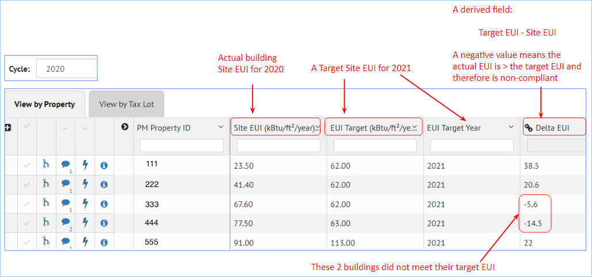
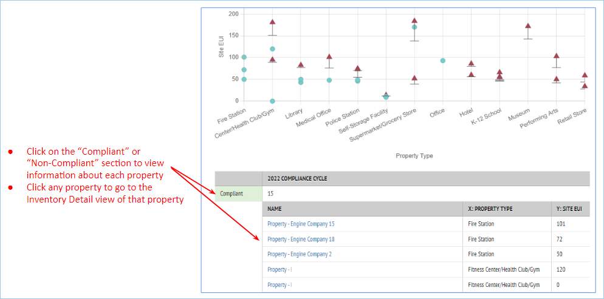
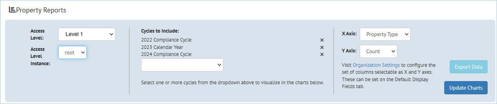
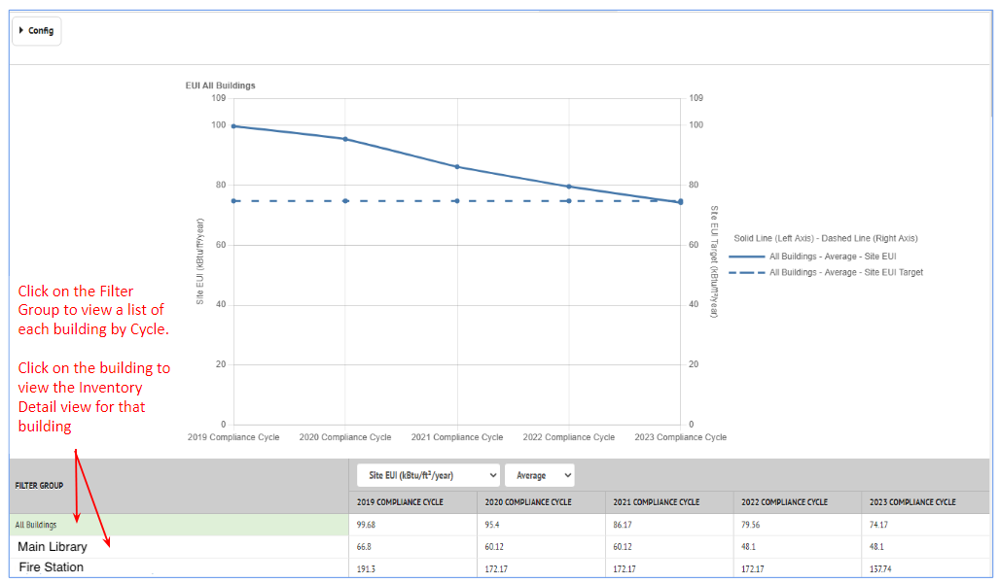

Insights can be used to compare metrics for building portfolios or individual buildings over time.

??? note "General Overview"
    ## General Overview

    Insights, accessed from the left navigation bar, allows comparison of metrics over time.

    

    Insights allows users to:

    - Import data into cycles over time with updated metrics in the building data as buildings are made more energy efficient
    - Compare the updated metrics to a target to understand how building energy performance is improving
    - View metrics at a portfolio level based on building type or other criteria
    - View individual buildings

    ### Insight Options

    The **Insights options** include:

    

    - **Program Overview**
    - **Property Insights**
    - **Default Reports**
    - **Custom Reports**
    - **Portfolio Summary**

    High level previews of the Insights options are shown below. More details are contained in the specific sections for each option.

    #### Program Overview

    This option shows portfolio compliance with a performance target over time

    

    #### Property Insights

    This option shows compliance for individual buildings

    

    #### Default Reports

    This option allows graphing of different metrics

    

    #### Custom Reports

    This options shows the metric trend over time for a collection of properties

    

    #### Portfolio Summary

    Details coming soon

??? note "Program Configuration"
    ## Program Configuration

    The Program Configuration screen is where the set up for a given "program" is defined

    ### Setting up the Data

    Because Insights is used to look at trends over time, it is necessary to import data over time in different cycles
    

    - Import metrics for each building as well as targets for those metrics
    - Define "derived fields" to calculate target "deltas" if that is useful

    

    ### Program Configuration

    Click on the Program Configuration link to define the criteria for these "program" reports
    

    There are three components to define on the Program Configuration page:

    - General Settings
    - Metric Type Settings
    - Visualization Settings

    

    #### General Settings

    For a new program, click the green New Program button, and the information under General Settings will be blank

    - Change the "New Program" name to the desired name
    - Choose the Cycles to use
    - Choose the Filter Group to use

    

    #### Metric Type Settings

    This section is where the compliance between the actual and the target metrics are defined

    

    #### Visualization Settings

    The Visualization Settings determine the X-Axis options in the Property Insights view

    

??? note "Program Overview"
    ## Program Overview

    The **Program Overview** option shows portfolio compliance with a performance target over time (cycles)

    

    ### Program Configuration

    Click the **Program Configuration** button to set up the metrics to compare

    

    In this example, the configuration setting are:

    **GENERAL SETTINGS**

    - **Cycles:** This EUI Comparison program is looking at data from 2019 - 2023
    - **Filter Group:** For this program, the filter group includes all buildings. If multiple Filter Groups are defined, more than one Filter Group can be selected here

    **METRIC TYPE SETTINGS**

    - **Metrics:** Site EUI
    - **Actual Value:** Site EUI (kBtu/ft2/year), from the pulldown list of fields for the building
    - **Target Value:** Site EUI Target (kBtu/ft2/year), from the pulldown list of fields for the building
    - **Type:** This setting defines "compliance". In this case, the Target EUI value must be larger than the Actual EUI value, meaning the building's actual site EUI is less than the target set for that building

    

??? note "Property Insights"
    ## Property Insights

    The **Property Insights** option shows the compliance status for individual buildings, again based on the program configuration settings.

    In the example below, the program being viewed has the following selections:

    - **Program:** EUI Comparison
    - **Cycle:** 2022
    - **Metric Type:** Energy metric (in this example, only energy metric is defined)
    - **X Axis:** Property Type

    

    Hovering over an individual point displays information about the property

    Clicking on that point will open the Inventory Detail view for that building

    

    Below the graph is a small table which shows the number of Compliant and Non-Compliant buildings. Clicking on either section will display a list of the individual buildings with each status.

    Clicking on an individual building will open the Inventory Detail view for that building.

    

    ###Program Configuration

    The **Program Configuration** set up for the **Program Overview** also controls the information shown here in **Property Insights**, repeated here for completeness.

    Click the **Program Configuration** button to set up the metrics to compare

    

    In this example, the configuration setting are:

    **GENERAL SETTINGS**

    - **Cycles:** This EUI Comparison program is looking at data from 2019 - 2023
    - **Filter Group:** For this program, the filter group includes all buildings. If multiple Filter Groups are defined, more than one Filter Group can be selected here

    **METRIC TYPE SETTINGS**

    - **Metrics:** Site EUI
    - **Actual Value:** Site EUI (kBtu/ft2/year), from the pulldown list of fields for the building
    - **Target Value:** Site EUI Target (kBtu/ft2/year), from the pulldown list of fields for the building
    - **Type:** This setting defines "compliance". In this case, the Target EUI value must be larger than the Actual EUI value, meaning the building's actual site EUI is less than the target set for that building

    

??? note "Default Reports"
    ## Default Reports

    Default reports allow graphing of different metrics

    

    ### Property Reports Settings

    

    This section of the page defines what data will be plotted, based on the selection of:

    - Cycles to include
    - X Axis metric
    - Y Axis metric

    

??? note "Custom Reports"
    ## Custom Reports

    Custom Reports show the metric trend over time for a collection of buildings

    

    **Config**

    The **Config** option in the upper right controls the display (or not) of the configuration settings. If it is "off", the display of the graph has more room on the web page

    

    The table below the graph can be expanded to show the individual properties, and clicking on the buildings will display the Inventory Detail view for the property.

    

??? note "Portfolio Summary"
    Details coming soon
