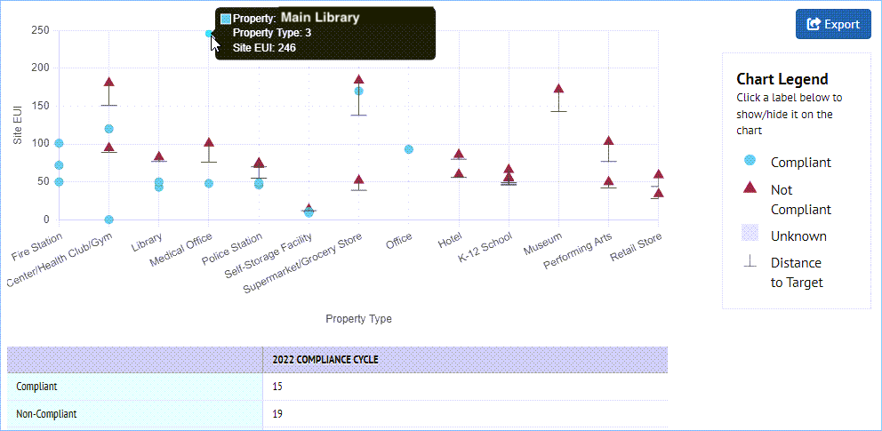
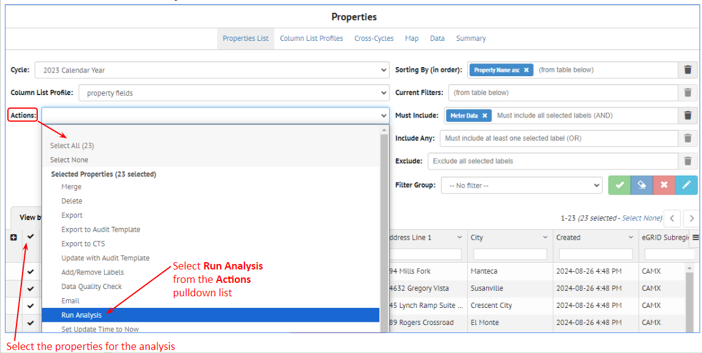

Insights can be used to compare metrics for building portfolios or individual buildings over time.

??? note "General Overview"
	## General Overview

	Insights, accessed from the left navigation bar, allows comparison of metrics, such as Energy or Greenhouse Gas Emissions, over time.

	

	This can be useful for implementing Building Performance Standards to reach zero energy or emissions goals by a certain date. 

	Insights allows users to:

	- Import data into cycles over time with updated metrics in the building data as buildings are made more energy efficient
	- Compare the updated metrics to a target to understand how building energy performance is improving
	- View metrics at a portfolio level based on building type or other criteria
	- View individual buildings

	### Insight Options

	The **Insights options** include:

	
	
	- **Program Overview**
	- **Property Insights**
	- **Default Reports**
	- **Custom Reports**
	- **Portfolio Summary**

	Below show high level previews of the Insights options. More details are contained in the specific sections for each option.

	#### Program Overview
	This option shows portfolio compliance with a performance target over time

	

	#### Property Insights
	This option shows compliance for individual buildings

	

	#### Default Reports
	This option allows graphing of different metrics

	

	#### Custom Reports
	This options shows the metric trend over time for a collection of properties

	

	#### Portfolio Summary
	Details coming soon

  
??? note "Program Overview"
	## Program Overview

	The Program Overview option shows portfolio compliance with a performance target over time (cycles)

	

	

??? note "Property Insights"
	## Property Insights

	x

	### x

	- x

	### x

	x

	
??? note "Default Reports"
	## Default Reports

	x

	### x

	x

	#### x
	x
	
	**x**
	x

	x

	### x

	1. x
	

	
??? note "Custom Reports"
	## Custom Reports

	### x

	- x

	### x

	- x

	

??? note "Portfolio Summary"
	## Portfolio Summary

	### x

	- x
