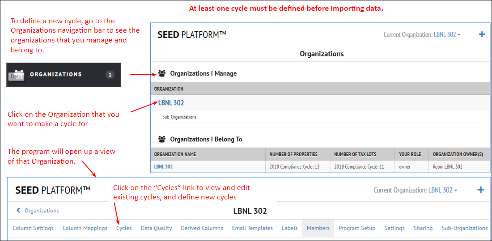

After the building data has been imported into SEED, it can be viewed from the Inventory navigation button

??? note "**Inventory List View**"

    ## xxx

??? note "**Inventory Detail View**"

    ## xxx

    x

    

## **xx**
x 
??? note "**xx**" 

    x

??? note "**xxx**"

   x

??? Note "**xxx**"

    x

    
## **xxx**

??? Note "**xx**"

    x

??? Note "**xxx**"

    x

??? note "**xxx**"

    x

??? note "**xxx**"
    x

## **xxx**

??? note "**xxx**"
    x

??? note "**xx**"

    x

??? note "**xxxx**"

    x

??? note "**xx**"
    x

