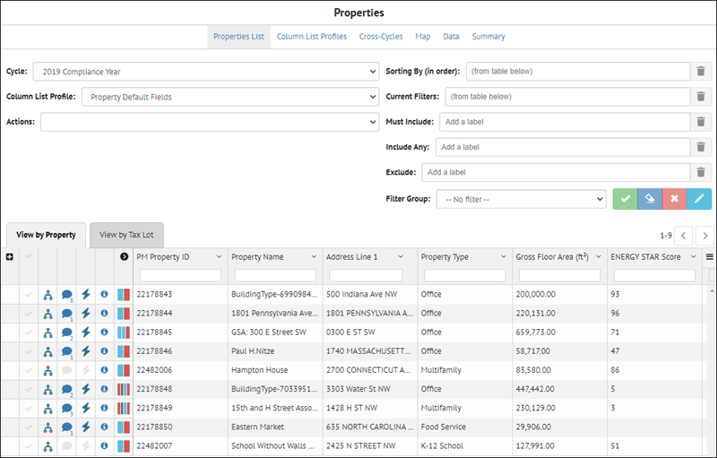
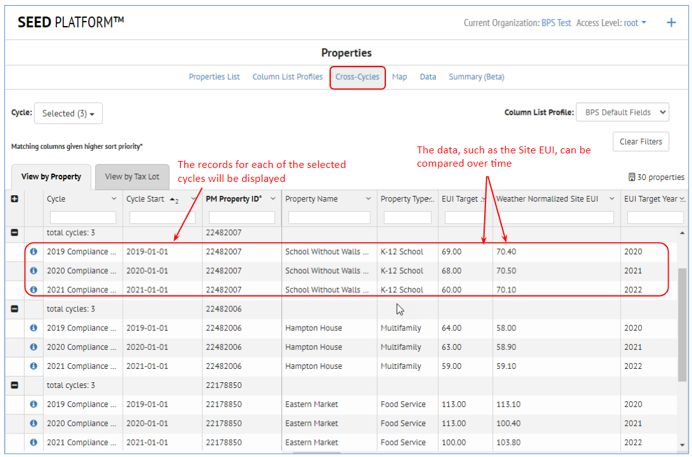
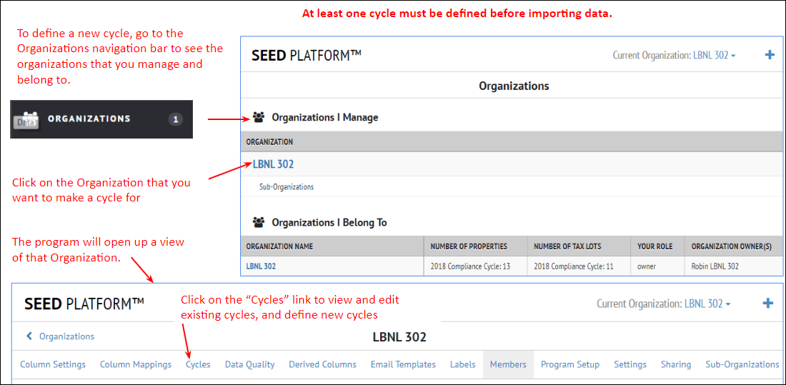

After the building data has been imported into SEED, it can be viewed from the Inventory navigation button

## **Inventory List View**

??? note "**Inventory List Overview**"

    The Inventory List view shows the data that has been imported into SEED. 
    
    It is viewed by Cycle, from the Cycle pulldown list in the upper left of the page.
    
    There are two tabs, one for **Property** records and one for **Tax Lot** (tax parcel) records. The **Property** tab is open by default, as that is generally the data most users are interested in viewing. However, if tax parcel data has been imported and associated with the property data, that will appear in the **Tax Lot** tab.

    

    If the Property tab is selected, the Properites links will displayed at the top of the page, which allow navigation to the pages related to the Property inventory. 

    

    If the Tax Lot tab is selected, the Tax Lot links will displayed at the top of the page, which allow navigation to the pages related to the Tax Lot inventory. 

    

    The links for both Properties and Tax Lots are named the same except for the first, which will show either the Property records or the Tax Lot records, depending on the tab that is selected. However, each link will show the records related to the currently selected tab, i.e., either Property or Tax Lot.
    
    * **Property List or Tax Lot List:** The default view, showing all the imported data by Cycle, for either the Property or Tax Lot records, depending on the tab selected
    * **Column List Profiles:** The defined column list profiles, which determine the fields that are displayed as well as their order -- there are separate Column List Profiles for the Property and Tax Lot tabs
    * **Cross-Cycles:** Compare the same records across multiple cycles
    * **Map:** Shows the data spatially on a map, if the data has enough information to map it
    * **Data:** Accesses the Custom Report definitions under Inisghts
    * **Summary:** Lists the fields in the inventory, with the count of records with populated data in those fields
    
??? note "**Property / Tax Lot Relationship**" 

    When importing data into SEED, in the data mapping step, a field is defined as belonging to either a Property or a Tax Lot 

    

    In the **Inventory List** view, it is possible to view fields from both Property and Tax Lot in the same tab, ie, the Property or Tax Lot tab. 

    It is also possible to see the relationship of properties and tax lots, such as the case where a property sits on multiple tax lots, or a tax lot has multiple properties on it, as shown below.

    

??? note "**Property or Tax Lot List View - General**" 
    
    Both the Property and Tax Lot tab have identical funcionality, but applied to either the Property or the Tax Lot records, depending on the tab selected. The screenshots are shown for the Property tab, but the Tax Lot tab will have identical features.

    For either the Property or the Tax Lot tab, to view the desired data do the following:

    * Select the **Cycle**
    * Select a **Column List Profile**

    The data for that Cycle will be displayed in the table for each tab, and the fields being displayed are based on the Column List Profile. Multiple Column List Profiles can be created in order to have different views of the fields. 

    There are icons to the left of each row, indicating whether the property is

    * Merged with another record (for example when an existing record is updated with another import)
    * Has a Note attached to the record
    * Has Meter Data associated with the record
    
    It is also possible to view all the labels that have been added to each record by clicking on the black arrow to the left of the first field in the table, as shown below. 
    
    

    The **Actions** pull down on the left hand side of the page is used to perform actions on a group of selected records (selected using the checkbox to the left of the other icons).

    The upper right side of the Property List view shows all the sorting and filtering options. Multiple filtering options can be grouped into a named "Filter Group".

    

??? note "**Column List Profiles**"

    Clicking on the **Column List Profile** link at the top of the Property List view displays the following screen, where the fields for each profile can be defined.

    

    Column List Profiles can be created, saved, renamed and deleted with the icons on the right side of the page.

    

    The column names in the Column List Profile can be moved (dragged with the mouse) up and down to change their order.

    

??? note "**Cross-Cycles**"
    
    It is possible to building data over time using the Cross-Cycles functionality. If there are multiple years of data imported into SEED in time-based cycles, that data can be compared across those cycles.

    In the Property List view, click on the Cross-Cycles link and select the cycles to be compared.

    

    After checking the cycles to display, click the main webpage and the data for the selected cycles will be displayed. It is then possible to compare the data across the cycles, for example to see if the **Weather Normalized Site EUI** values have come down for a specific property over time.

    

    

??? note "**Map**"

??? note "**Data**"

??? note "**Summary**"

## **Inventory Detail View**

??? note "**Inventory Detail Overview**"

    ## xxx

    x

    

## **xx**
x 
??? note "**xx**" 

    x

??? note "**xxx**"

   x

??? Note "**xxx**"

    x

    
## **xxx**

??? Note "**xx**"

    x

??? Note "**xxx**"

    x

??? note "**xxx**"

    x

??? note "**xxx**"
    x

## **xxx**

??? note "**xxx**"
    x

??? note "**xx**"

    x

??? note "**xxxx**"

    x

??? note "**xx**"
    x

