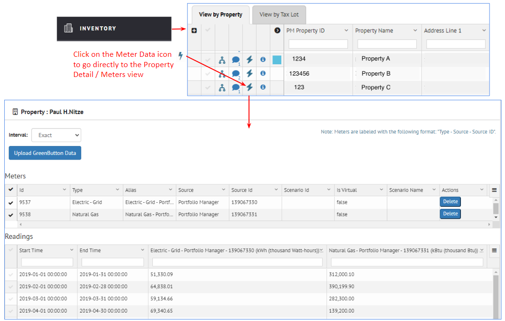
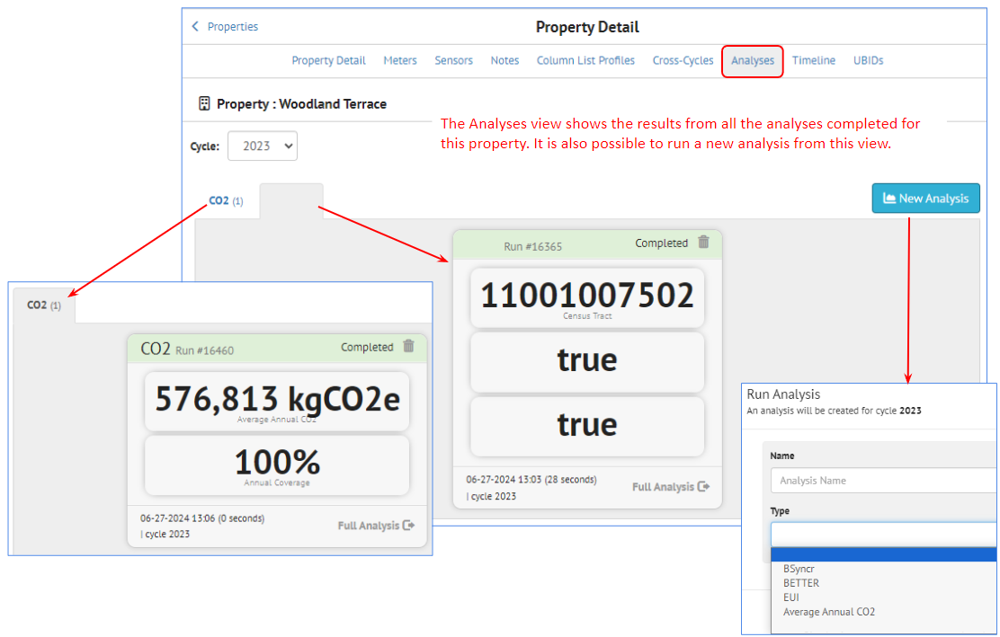
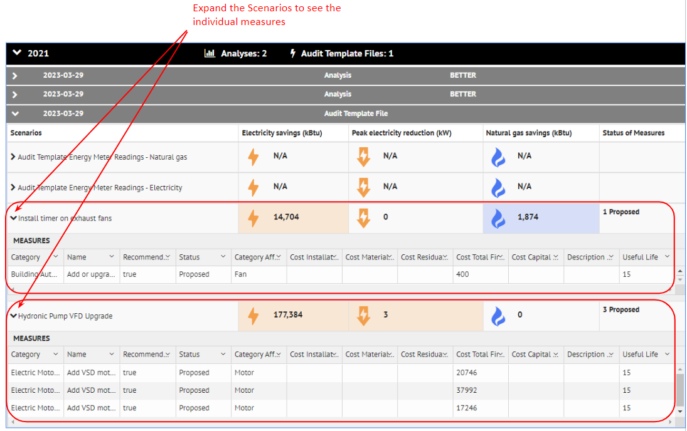

After the building data has been imported into SEED, it can be viewed from the Inventory navigation button

## **Inventory List View**

??? note "**Inventory List Overview**"

    The Inventory List view shows the data that has been imported into SEED. 
    
    It is viewed by Cycle, from the Cycle pulldown list in the upper left of the page.
    
    There are two tabs, one for **Property** records and one for **Tax Lot** (tax parcel) records. The **Property** tab is open by default, as that is generally the data most users are interested in viewing. However, if tax parcel data has been imported and associated with the property data, that will appear in the **Tax Lot** tab.

    

    If the Property tab is selected, the Properties links will displayed at the top of the page, which allow navigation to the pages related to the Property inventory. 

    

    If the Tax Lot tab is selected, the Tax Lot links will displayed at the top of the page, which allow navigation to the pages related to the Tax Lot inventory. 

    

    The links for both Properties and Tax Lots are named the same except for the first, which will show either the Property records or the Tax Lot records, depending on the tab that is selected. However, each link will show the records related to the currently selected tab, i.e., either Property or Tax Lot.
    
    * **Property List or Tax Lot List:** The default view, showing all the imported data by Cycle, for either the Property or Tax Lot records, depending on the tab selected
    * **Column List Profiles:** The defined column list profiles, which determine the fields that are displayed as well as their order -- there are separate Column List Profiles for the Property and Tax Lot tabs
    * **Cross-Cycles:** Compare the same records across multiple cycles
    * **Map:** Shows the data spatially on a map, if the data has enough information to map it
    * **Data:** Accesses the Custom Report definitions under Insights
    * **Summary:** Lists the fields in the inventory, with the count of records with populated data in those fields
    
??? note "**Property / Tax Lot Relationship**" 

    When importing data into SEED, in the data mapping step, a field is defined as belonging to either a Property or a Tax Lot 

    

    In the **Inventory List** view, it is possible to view fields from both Property and Tax Lot in the same tab, ie, the Property or Tax Lot tab. 

    It is also possible to see the relationship of properties and tax lots, such as the case where a property sits on multiple tax lots, or a tax lot has multiple properties on it, as shown below.

    

??? note "**Property or Tax Lot List View - General**" 
    
    Both the Property and Tax Lot tab have identical functionality, but applied to either the Property or the Tax Lot records, depending on the tab selected. The screenshots are shown for the Property tab, but the Tax Lot tab will have identical features.

    For either the Property or the Tax Lot tab, to view the desired data do the following:

    * Select the **Cycle**
    * Select a **Column List Profile**

    The data for that Cycle will be displayed in the table for each tab, and the fields being displayed are based on the Column List Profile. Multiple Column List Profiles can be created in order to have different views of the fields. 

    There are icons to the left of each row, indicating whether the property is

    * Merged with another record (for example when an existing record is updated with another import)
    * Has a Note attached to the record
    * Has Meter Data associated with the record
    
    It is also possible to view all the labels that have been added to each record by clicking on the black arrow to the left of the first field in the table, as shown below. 
    
    

    The **Actions** pull down on the left hand side of the page is used to perform actions on a group of selected records (selected using the checkbox to the left of the other icons).

    The upper right side of the Property List view shows all the sorting and filtering options. Multiple filtering options can be grouped into a named "Filter Group".

    

??? note "**Data Management**" 
    
    The grid used in the Inventory List view has many features (explained in detail in the following sections)

    * **Filter:** enter filter criteria in the blank box under the column name
    * **Sort:** click in the middle of the column header to see the small up and down arrows to sort ascending and descending; alternatively select the right menu arrow in the column to see the Sort Ascending, Sort Descending and Remove Sort options
    * **Hide fields:** click on the right menu arrow in an individual field to Hide a field that is displayed. More control over what fields are displayed and their order is controlled with the Column List Profiles.
    * **Field order by dragging columns:** click in the middle of a column header, hold the left mouse button down, and drag it right or left to place it the desired order 
    * **Pin columns:** click on the right menu arrow in an individual column to see the Pin Left, Pin Right and Unpin options for that column
    * **Resize columns:** click on the right hand side of the column header, hold the left mouse button down, and drag the column edge right and left to the desired width 
    * **Fixed column headers:** the column headers are fixed, so scrolling down keeps the column headers visible. 
    * **Pagination:** The records are displayed 100 records per page. 

    ### Filter

    There are many filter options, such as numeric or text filtering on columns, as well as filtering by labels and making filter groups which allows naming a set of filter choices.

    

    **Filtering on individual fields follows the following format.**

    

    **Most of the lists in SEED (Mapping, Matching, Inventory) allow you to sort and filter on the data in the columns by entering the filter values in the input box below the field (column name)**

    

    

    **Filter Groups**

    Filter Groups can be defined to save all the filtering and sorting options selected. 

    To create a filter group, filter the data as needed, using field filter inputs and/or labels and then click the "New Filter Group" icon to name that combination of filters. 

    

    ### Sort

    It is possible to control sorting in two different ways:

    **Up/down arrow**
    **Column pulldown list**

    

    ### Pin Columns

    Columns (one or more) can be pinned on the left and the right

    

    ### Actions

    The Actions pulldown list has many options for managing the data in the Inventory List view.

    

    The options available are:

    * **Select All:** This will cause all the records in the cycle to be selected
    * **Select None:** This will cause all the records that might have been previously selected to become "unselected". 
    
    For the selected properties (based on filters or above options)

    * **Merge:** Merge the selected records
    * **Delete:** Delete the selected records
    * **Export:** Export the selected records
    * **Export to Audit Template:**
    * **Add/Remove Labels:** Add or remove records to/from the selected records
    * **Data Quality Check:** Run the Data Quality checks on the selected records
    * **Email:** Send emails (from the email template) to the selected records
    * **Run Analysis:** Run an analysis on the selected records
    * **Set Update Time to Now:**
    * **Geocode:** Geocode the selected records. This requires having complete address information defined for each record, and will result in latitude and longitude values being generated for the selected records
    * **Decode UBID:**
    * **Compare UBIDs:** Compare the UBIDs of two or more records based on the Jaccard index set for the organization
    * **Add/Update UBID:** Edit the UBID(s) associated with the selected record (this option is only available when a single record is selected)
    * **Update Salesforce:** Sync information from the selected records with the connected Salesforce instance

    Options

    * **Only Show Populated Columns:** This will cause the Inventory list to be refreshed to display on the fields that have data in them. This can be a useful first step after importing data. The resulting field display definition will be saved to the current Column List Profile (if one doesn't exist, the program will ask for a name for a new Column List Profile)

??? note "**Column List Profiles**"

    Clicking on the **Column List Profile** link at the top of the Property List view displays the following screen, where the fields for each profile can be defined.

    

    Column List Profiles can be created, saved, renamed and deleted with the icons on the right side of the page.

    

    The column names in the Column List Profile can be moved (dragged with the mouse) up and down to change their order.

    

??? note "**Cross-Cycles**"
    
    It is possible to building data over time using the Cross-Cycles functionality. If there are multiple years of data imported into SEED in time-based cycles, that data can be compared across those cycles.

    In the Property List view, click on the Cross-Cycles link and select the cycles to be compared.

    

    After checking the cycles to display, click the main webpage and the data for the selected cycles will be displayed. It is then possible to compare the data across the cycles, for example to see if the **Weather Normalized Site EUI** values have come down for a specific property over time.

    

??? note "**Map**"

    SEED will display the buildings on a map view if there is enough information to locate them geospatially. The buildings need to have good address information (including street address, city and postal code) in order to display them on the map. 

    If that data has been provided on import, SEED can display the locations when the Map link is clicked. 

    
        
    Zoom in on the map using the mouse to see the details of building in the census tracts designated as **Disadvantaged Communities (DAC)**

    

??? note "**Data**"

    The Data link goes to the Custom Reports view where different data across cycles can be plotted.

    

??? note "**Summary**"

    The Summary link shows a list of all the fields in the selected cycle, with the number of records that have data for that field.

    

## **Inventory Detail View**

??? note "**Inventory Detail Overview**"

    The **Inventory Detail** view shows details about individual buildings, including a history of all the files that have been imported and added data to this building record. 

    The links at the top of the Detail view are the following:

    

    * **Property Detail:** This is the default view when coming from the List view
    * **Meters:** The meter data imported with this property, if relevant
    * **Sensors:** The sensor data imported with this property, if relevant
    * **Notes:** Access any notes already associated with this property, or add new ones
    * **Column List Profiles:** The defined column list profiles, which determine the fields that are displayed as well as there order. New column list profiles can be defined here. 
    * **Cross-Cycles:** Compare the data for this property across cycles.
    * **Analyses:** View the analyses associated with the property, organized by cycle
    * **Timeline:** View a timeline of events that have occurred on a property. Events currently include analyses run, measures and scenarios uploaded via BuildingSync, and notes added to a property.
    * **UBID:** View, add, and modify the UBID(s) associated with the property.

    This view is accessed by clicking on the small "i" icon to the right of the building in the Inventory List view. 

??? note "**Property Detail**"

    The Property Detail view is the default view that is displayed when clicking the "information" icon in the List view. 

    * **Actions:** The actions pulldown list has many options, which can be selected to perform those actions on the property currently being viewed. One of the more useful options to select after importing data is the last option "Only Show Populated Columns". This will cause only those fields with data in them to be displayed and the selected Column Profile List will be updated with this information. 
    
    * **Cycle:** This view is organized by **Cycle**, which can be selected from the Cycle pulldown list. 
    * **Labels:** This view also shows the labels associated with this building.    
    * **Access Level Instance Information:** if the Access Level Hierarchy is used, the appropriate information will be displayed here.
    * **Column List Profile:** The defined column list profiles, which control the fields displayed and their order, can be selected from the pulldown list.

    The table shown in the main section of the Detail view has the following columns:

    * **Field:** Shows each field in the database for this record
    * **Main:** This is the merged data based on the history of data imported, shown in the columns to the right of the Main column
    * **History of imported files:** The columns to the right of Main show all the files that have been imported that added data to this property. The order of import is from left to right, so the latest imported data will be the first column to the right of Main, and the first import will be the far right column. There is a scroll bar to scroll to the right if there have been many imports. 
    * **Highlighted lines:** The lines that have different data in them from previous imports, and that have been merged into Main, will be highlighted in yellow

    

??? note "**Meters**"

    When meter data is imported for a property, it can be viewed either from:
    
    * **Inventory List:** view by clicking on the Meter icon to the left of the property record
    
    
    
    * **Inventory Detail:** view from the Meter link
    
    

    The meter data can be aggregated by using the Interval pulldown list

    
    

??? note "**Sensors**"

     Sensor data that has been collected on a time interval from a data logger can be imported into SEED for individual properties. In the example below, air quality data was collected in school classrooms, and then imported into SEED.

     
     
     When sensor data is imported for a property, it can be viewed from the Sensor link in the Inventory Detail view

     

??? note "**Notes**"

    Notes can be added to a property either manually by clicking on Notes and typing a note. They are also added automatically by the program when data is changed. 
    
    

??? note "**Column List Profiles**"

    Column List Profiles control what fields are displayed and in what order. It is possible to create as many Column List Profiles as needed to have different views of the data. 

    In a similar manner to the List view Column List Profiles, new profiles can be created, and existing profiles can be edited. 

    

??? note "**Cross-Cycles**"

    The Cross-Cycle view allows comparison of each field across the cycles, for example to show trends in Site EUI or emissions.

    

??? note "**Analyses**"

    The Analyses view shows the results from all the analyses completed for this property. It is also possible to run a new analysis from this view.

    

??? note "**Timeline**"

    Clicking the Timeline link for a property will show all the actions across cycles.

    

    Click the arrows to expand and collapse the details of each action.

    

    If Audit Template information has been imported, click on the arrow to expand the details to see the scenarios.

    

    Within the Audit Template scenarios, click on the down arrow to see in individual measures in each scenario.

    

??? note "**UBIDS**"

    Clicking the UBID link for a property will show all the UBIDs that have been associated with that property. Because a property can have more than one UBID value, it is necessary to set one of them to "Preferred", which can be done by clicking the Edit icon. UBIDs can also be deleted by clicking the Delete icon. And UBIDs can be added by clicking the Create UBID button. 

    