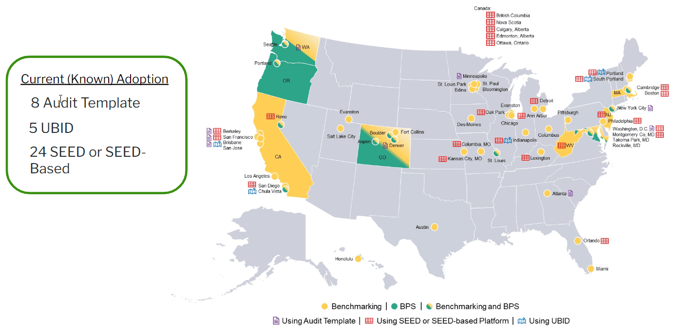
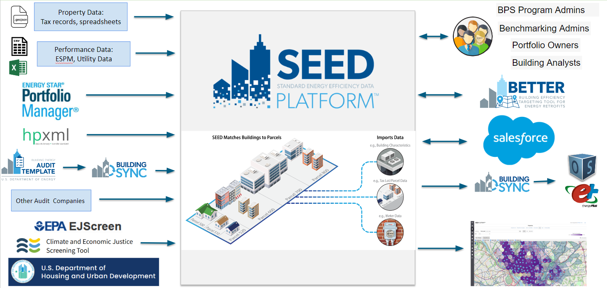
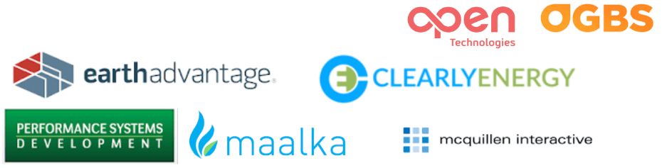

??? default "Standard Energy Efficiency Data Platform (SEED)"

    The Standard Energy Efficiency Data Platform (SEED) Platform is an open-source software application designed to manage building performance data, such as energy consumption and carbon emissions (as required by a benchmarking ordinance or Building Performance Standard), which can be costly and time consuming for states, local governments and other organizations. SEED is a flexible and cost-effective platform to improve the quality and availability of data to demonstrate the economic and environmental benefits of building energy efficiency, to implement programs, and to target investment activity. SEED helps users combine data from multiple sources, clean and validate it, and generate queries and reports. SEED can be used directly as a web platform, but it can also be used as a backend to other solutions. 

    As of December 2023, these are the cities who either have benchmarking or Building Performance Standards that are also using SEED to help with those ordinances

    

    Many communities, jurisdictions and cities are managing their data for these ordinances using spreadsheets. This is a strategy that has many drawbacks including:

    * Difficulty in managing and tracking hundreds of building records
    * Limited simultaneous access
    * Limited data protection and user access controls
    * Loss of functional knowledge upon staff turnover
    * Lack of ability to easily integrate with other solutions

## Features

The core functionality of SEED includes the ability to

* Handle the complicated nature of building data, such as the relationship between parcel / tax lot data and buildings
* Import data from many sources and map to standardized fields
* Automate data quality checks
* Automate merging, matching and linking of data
* Provide a web based platform with use access controls
* Provide visual reports to evaluate the status of the buildings

One of the most powerful aspects of SEED is the ability to import data from many different sources for a set of buildings, such as 

* Spreadsheets of jurisdiction tax records or other property data, which can be imported in a way that defines the relationship between tax parcels and buildings
* Building utility data 
* Building performance data from ENERGY STAR Portfolio Manager
* Building asset data from DOE tools such as Audit Template and BuildingSync
* Spatial data such as GeoJSON

It is also possible to dynamically connect the records in SEED to other applications such as Salesforce.

Once the data is imported into SEED it is possible to:

* Check the data quality based on used defined rules
* Sort, filter and label building records
* Run analyses on the building data, such as calculating the CO2 emissions and the Energy Use Intensity (EUI)
* Set future targets for CO2 emissions and EUI values to plan how to reach net zero by a certain time period
* View the progress reaching those targets, either at the building level or the portfolio level
* View a map of the building locations

## Web-based Platform

SEED is an [open source web based platform](https://github.com/SEED-platform/seed) that can be deployed as is, or it can be used as the base for additional functionality. SEED provides both a browser-based interface for users to upload and manage their building data, as well as a full set of APIs that app developers can use to access these same data management functions. 

SEED is funded by the U.S. Department of Energy and supported by the National Renewable Energy Laboratory (NREL), Lawrence Berkeley National Laboratory (LBNL), and the third party software contributors shown below.

