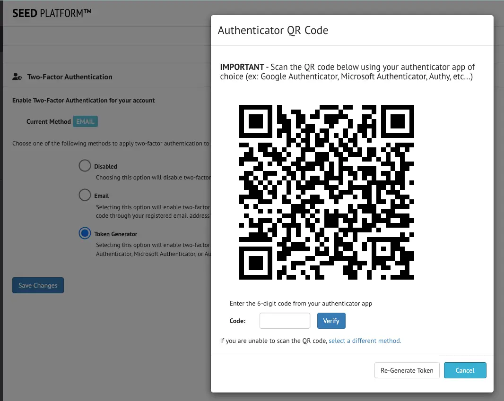
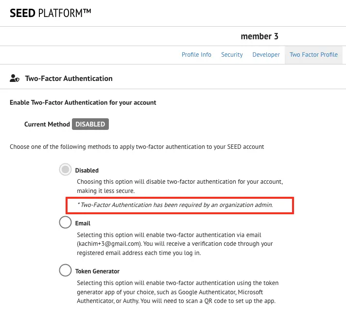
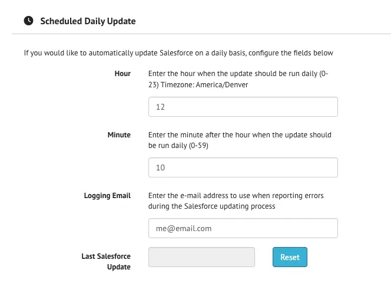
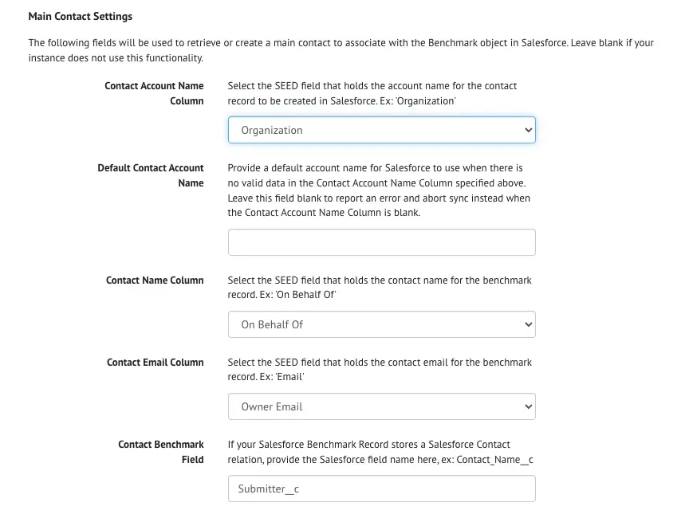
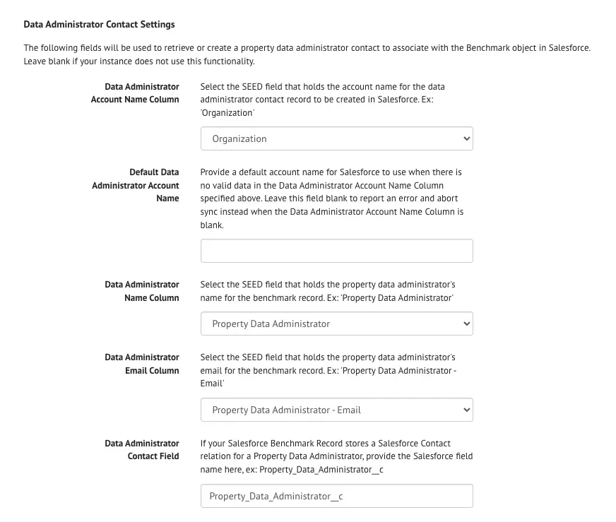
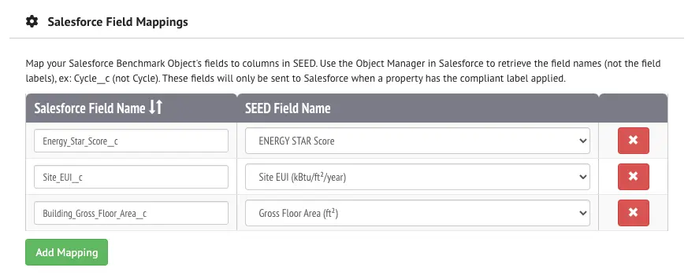

Expand the following sections to find out more about different functionality available in SEED.

??? note "Setting up a Public Feed"
	## Enabling and Configuring your Organization's Public Feed

	Organization owners can enable a Public Feed of their properties and tax lots. They can select a subset of fields that will be made public. The public feed is available in JSON and HTML formats.

	The Public Feed functionality can be enabled from the organization settings page. From this same page you can choose to expose the labels applied in the public feed.

	{:.seed-img}

	Once the functionality is enabled, navigate to the Organization Sharing page. From this page, you can set up which fields should be shared by checking the checkbox next to each field.  Both property and tax lot fields will be listed, and you can use the filters on the top of the table to refine your search.

	{:.seed-img}

	The Public Feed is available at the following URL:
	{SEED URL}/api/v3/public/organizations/{ORGANIZATION ID}/feed.json
	where {SEED URL} is the URL of your SEED instance (https://seedv2.lbl.gov, for example), and {ORGANIZATION ID} is the ID of your organization within SEED.  

	The Public Feed page will load a JSON view of the data that you have configured to share publicly, organized by cycle. The ‘id’ key shown here corresponds to a ‘property view’ in SEED, which represents the building data in a specific cycle. The ‘pagination’ section provides statistics on the number of properties available, the ‘query_params’ section returns the filters that were applied to generate this list, and the list of buildings can be found in the ‘data’ section.

	{:.seed-img}

	### Public Feed Filtering Details

	The public feed endpoint returns property and tax lot data for a given organization as a json object. The results are ordered by "last updated". Optional and configurable URL query parameters:

	- *labels* - if enabled, comma-separated list of case sensitive label names. Results will include inventory that has any of the listed labels. Default is all inventory
	- *cycles* - comma-separated list of cycle IDs. Results include inventory from the listed cycles. Default is all cycles
	- *properties* - boolean to return properties. Default is True
	- *taxlots* - boolean to return tax lots. Default is True
	- *page* - integer page number. Default is 1
	- *per_page* - integer results per page. Default is 100
  
  	### Example Requests

	{SEED URL}/api/v3/public/organizations/{organization_id}/feed.json?{query_param1}={value1}&{query_param2}={value2}

	{SEED URL}/api/v3/public/organizations/{organization_id}/feed.json?page=1 

	{SEED URL}/api/v3/public/organizations/{organization_id}/feed.json?page=2&labels=Compliant&cycles=1,2,3&taxlots=False 

??? note "Enabling Two-Factor Authentication"
	## Two-Factor Authentication for SEED Login

	SEED now supports Two-Factor Authentication. Two-Factor authentication requires users to provide two pieces of identification to access the site: the password as well as a verification code.

	SEED users can choose to enable Two-Factor Authentication; they can also choose their method of verification.  SEED's Two-Factor Authentication implementation supports email verification as well as verification via a token generator app. Example token generator apps include Google Authenticator, Microsoft Authenticator, Authy, or the Authenticator extension for the Chrome browser. 

	To enable Two-Factor Authentication, first sign in to the SEED Platform. Once you are signed in, navigate to the menu item with the gear icon and your name (the first one in the left navigation bar). This will take you to your profile page. From there, select the 'Two-Factor Profile' tab from the top of the page.

	{:.seed-img}

	From this page, you can see the Two-Factor Authentication method currently enabled (if any). You can also select a method to enable.  The *Email* method will send an email message with a verification code each time you sign in to the site. You will need to enter this code to gain access to your SEED organization.  The *Token Generator* method will prompt you to configure a Token Generator app of your choosing to generate a code for you to sign in to your SEED organization. When selecting this method, a QR code will be generated that you can scan with your selected Token Generator app.

	{:.seed-img}

	Two-Factor Authentication can be enabled on a per-user basis. Alternatively, an organization admin can choose to require Two-Factor Authentication for all of its users. This functionality can be enabled from the Organization Settings page: 

	{:.seed-img}

	Once this functionality is enabled at the organization level, all members of the organization will be prompted to enable Two-Factor Authentication at their next sign in:

	{:.seed-img}

??? note "Connecting to a Salesforce Instance and Configuring Automatic Updates"
	## Connection to Salesforce and Configuring Automatic Updates

	The SEED platform now supports a Salesforce connection via automatic updates to Salesforce Benchmark objects. As each jurisdiction’s Salesforce setup will be unique, SEED enables a high degree of customization for this functionality that should be able to support most cases.

	### Prerequisites

	The SEED-Salesforce process requires that the Salesforce instance configure the Accounts, Contacts, Properties, and Benchmarks objects. SEED will mostly interact with Salesforce by updating the Benchmark objects that are associated with Properties; SEED is also capable of creating Account and Contact objects in Salesforce.

	### Process Overview

	1. Add a Contact and Account to Salesforce. The Account/Contact relationship is important and dictated by Salesforce
	1. Add a Property to Salesforce. 
	1. Add a Benchmark to a Salesforce Property.
	1. In the SEED data import spreadsheet, ensure that there is a column for the unique Benchmark Salesforce ID used to track the benchmark. The name of this field is customizable and needs to be identified in the organization settings page. For this overview we will refer to it as "Benchmark Salesforce ID". This ID can be retrieved from Salesforce and will correspond to a Property within a specific cycle in SEED.
	1. Import the data spreadsheet into SEED in a particular cycle
	1. Manually add the indication label (ex: “Add to Salesforce” label) to any SEED property record that you want to sync with Salesforce. This label is specified in the SEED organization settings page (more information on that later). You may need to add a new label to SEED to capture this information.
	
	1. According to the organization's custom workflow, add either a "complied" or "violation" label to SEED property records. Data quality checks can also be configured to add labels automatically based on certain criteria. You may need to add new labels to SEED to capture this information.
	1. Update Salesforce either on demand or on an interval customized in the organization settings page. Check each SEED record with the "Add to Salesforce" label applied. If a record was updated after the last update timestamp AND the SEED record has a populated "Benchmark Salesforce ID" field, it is eligible for a Salesforce update. The update process is detailed below:
		
		- **Step 1** - Check for Contact and Account matches in Salesforce. The process matches on Email for contact (stored in a designated field in SEED as specified in the organization settings), and Name (stored in a designated field in SEED as specified in the organization settings ) for Account. If no Contact or Account objects are found, the process will create the Salesforce objects and associated them with the Benchmark object.
		
		- **Step 2** - Retrieve the SEED record's applied labels. If the "complied" label is applied OR the "violation" label is applied (but not both and not none), the record can be updated. If both the "complied" and "violation" labels are applied, or neither, an error will be logged and the Salesforce record will not be updated.
		
		- **Step 3** - Prepare the Salesforce Update by mapping the SEED fields to Salesforce's Benchmark Object fields. These mappings are all customizable and defined in the organization settings page.
		
		- **Step 4** - If the "violation" label is applied, a subset of Salesforce fields will be updated: Status, SEED labels, contact Name, Property Data Administrator.
		- **Step 5** - If the "complied" label is applied, all mapped Salesforce Benchmark fields will be updated

	### Available Configurations

	The SEED to Salesforce process requires quite a few customizations. These can all be made in the Salesforce section of the organization settings page in SEED.  The first step is to enable Salesforce Integration:

	{:.seed-img}

	#### Connection Information

	Once enable, the Salesforce instance's information can be entered, and the connection can be tested. You will need to enter the salesforce instance URL, the username, password, and security token to use for connecting. The Domain input only needs to be filled out if you are using a sandbox Salesforce instance; otherwise this field should be left blank.  The security token can be retrieved by navigating to your Salesforce profile page, then selecting "Reset My Security Token" from the left navigation menu. You will then receive an email with the new security token.

	{:.seed-img}

	To test the connection, enter your credentials and click the 'Test' button to ensure that you can connect to your Salesforce instance.

	#### Scheduled Update Customization

	The SEED to Salesforce Update workflow can be configured to run automatically on a daily interval at a specific time of the day. To enable this functionality, provide:
 		- The Hour and Minute at which to run the automatic update process
		- An email address where any errors encountered should be sent

	The web interface will display a timestamp of the last time the update process was run as well as a method to clear this timestamp. The date is used to compare SEED property updated at timestamps: only those properties with a timestamp later than the 'last run timestamp' are considered for an update.  It may be necessary to clear this timestamp for troubleshooting purposes.

	{:.seed-img}

	#### Workflow Customizations
	
	The next section contains several fields that can be used to customize the SEED to Salesforce workflow.

	##### Labels
	
	The SEED to Salesforce workflow is dependent on 3 different labels in order to perform updates:
	 - The **Indication label** indicates that a property should be considered for updates in Salesforce. It is required by the workflow.
	 - The **Compliance label** indicates that a property has been identified as being compliant and that all relevant fields can be updated in the Salesforce benchmark object.
	- The **Violation label** indicates that there is a problem with the data and only the status should be updated in the Salesforce benchmark object.  
	
	Either the Compliance label or the Violation label (and not both) is required to update Salesforce.

	##### Unique Benchmark ID
	
	A unique benchmark ID is required both on the Salesforce side and on the SEED side to uniquely identify the benchmark to update.  Information on the field name in Salesforce (the api name, not the field's display name) and the column in SEED is required to enable this workflow.

	##### Additional non-property fields
	
	The remaining fields in this section are optional and can be configured if your Salesforce object captures this information:
	- **Cycle Name** – the name of the Salesforce Benchmark field in which to store this information (api name, not display name)
	- **Status Label** — the name of the Salesforce Benchmark field in which to store the compliance or violation status label applied (api name, not display name)
	- **All Labels field** — the name of the Salesforce Benchmark field in which to store a string of all the SEED label names assigned to a property (api name, not display name)

	{:.seed-img}

	#### Contacts and Accounts Customizations

	The next section configures the Contacts and Accounts creation functionality. This is used to notify the Property Benchmarking Contact of the status of their Benchmark from within Salesforce. Since contact information can change over the life of a benchmarking program, it may be necessary to update contact information each year. Salesforce stores this information in a Contact object, which must be tied to an Account object. If contacts and accounts for the specific users do not exist, they will be automatically created by the SEED to Salesforce workflow, provided that the following fields are configured.

	##### Contact and Account Object Record Types

	{:.seed-img}

	- **Account Object Record Type** - If your Salesforce instance has multiple account types, provide the Record Type ID of the type of account to use when accounts are automatically created by SEED

	- **Contact Object Record Type** - If your Salesforce instance has multiple contact types (for example: Assessor, Benchmark Contact, Contact), provide the Record Type ID of the type to use when contacts are automatically created by SEED. The Record Type ID can be found in Salesforce by navigating to Setup-> Object Manager, then selecting the Contact object and clicking on Record Types from the left nav. Lastly, click on the record type you want to select and inspect the URL. The Record type ID will be at the end of the URL, right before "/view".

	For example, the Record Type ID in the following URL is 0133w000000ZrdFBBX: 
	
	`https://my-salesforce.com/lightning/setup/ObjectManager/Contact/RecordTypes/0133w000000ZrdFBBX/view.`

	Once these are configured, configure the Main Contact and the Property Data Administrator Contact (where applicable). The two sections are very similar but represent two different contacts that may be used in an organization's workflow:

	- **Main Contact Details**

	{:.seed-img}

	- **Data Administrator Contact**

	{:.seed-img}

	#### Benchmark Mapping Customizations
	
	The Salesforce Benchmark record can contain many custom fields which need to be populated from data in SEED. This process will need to be customized for each organization. A web interface is provided to map each Salesforce Benchmark record field to its SEED column containing the data:

	{:.seed-img}

	Once you have completed these sections, click the Save button.

	### Triggering the SEED to Salesforce Workflow

	There are a few ways to trigger a Salesforce update from SEED. The prerequisites for a successful sync are that the Salesforce functionality be enabled and configured in the SEED Organization Settings page as detailed in the previous section.

	#### Manually Update Salesforce for a single property

	The update can be manually triggered for a single property from the property’s Inventory Detail Page in SEED and selecting 'Update Salesforce' from the Actions Dropdown button at the top of the page. This functionality will ignore the last update date and will force an update in Salesforce. The success or failure of the operation will be displayed in a notification on the screen.

	{:.seed-img}

	#### Manually Update Salesforce for Multiple Properties

	Similarly, the Salesforce update can be manually triggered for a selected number of properties from the Property Inventory Page in SEED. Select the properties you would like to update in the table, then select 'Update Salesforce' from the Actions dropdown at the top of the page. This functionality will ignore the last update date and will force an update in Salesforce. The success or failure of the operation will be displayed in a notification on the screen.

	{:.seed-img}

	#### Automatic Daily Update

	If the scheduled daily update section of the Settings page is configured, automatic daily updates will occur at the specified hour and minute each day. A log of any errors encountered will be sent to the email specified in the Organization Settings Page. 

